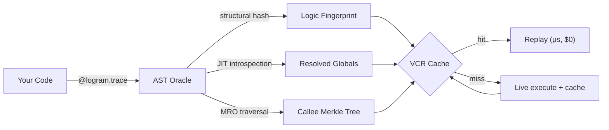

# LOGRAM

> **AI agent installing this?** Run `logram init` first, then read `LOGRAM_AGENT_RULES.md`.

**The Logic Persistence Layer for AI Engineering.** 

Logram is a Python SDK that records every step and state of your AI pipeline locally, then replays unchanged steps from cache when you re-run. Edit one prompt at step 97, validate the fix in seconds without re-paying for the 96 upstream steps that didn't change.

Stop monitoring failures. Start fast-forwarding them.
Fix logic in seconds, not minutes. Save 99% on API costs. ⭐


[](https://logram.dev/waitlist)

---

## The Problem: The AI Feedback Loop is Broken

AI engineering is currently 90% waiting and 10% thinking. 

Imagine a pipeline processing 150 image tiles through a VLM. At step 97, you notice a logic error or a prompt hallucination. Today, you are forced to:
1. **Wait** 4 minutes for steps 1–96 to re-execute.
2. **Pay** ~$0.80 in redundant API tokens just to reach the failure point.
3. **Guess** the fix because AI agents have zero visibility into the actual runtime state of previous runs.

This **"Tax on Curiosity"** prevents developers from testing more hypotheses and forces AI agents to assume fixes based on static files rather than empirical facts.

**Logram collapses this tax.**

| Feature | Without Logram | **With Logram (Replay)** |
| :--- | :--- | :--- |
| **Re-run cost** (150-tile VLM) | ~$0.80 | **~$0.004 (Surgical)** |
| **Feedback Latency** | ~4 minutes | **~2 seconds** |
| **Agent Autonomy** | Blind Guesswork | **Closed-loop Engineering** |
| **Determinism** | Low (Full re-run) | **Total (Unchanged logic frozen)** |

---

## What Logram Is

Logram acts as a **Silent Passenger** in your Python code. By adding a simple `@trace` decorator, you establish a persistent record of your pipeline's logic, data flow, and state, **all staying 100% local.**

### 1. Deep Fingerprinting
Logram doesn't just hash inputs. It maps your code's **Topology**. Before a step runs, it computes a logic fingerprint using:
- **Structural AST Hashing:** Detects logic changes while ignoring formatting, comments, or Python version shifts (3.10 to 3.13).
- **MRO-Aware Resolution:** Tracks changes in parent class methods through the Method Resolution Order.
- **Constant Scavenging:** Captures the real-time values of prompts and configs, even in `snake_case` or nested modules.

### 2. Logic Oracle (Divergence Analysis)
When a pipeline performed better yesterday than today, Logram’s engine can performs an **exhaustive tree walk** to identify the exact point of divergence between the two runs. It finds the prompt that changed 3 levels deep in your call-graph and shows you the unified diff.

### 3. Surgical Replay
When you re-run, unchanged steps are replayed from the local SQLite store in **0.001s**. Only the modified logic—and the steps impacted by its new output—execute live.

### 4. Agentic Autonomy:

AI coding agents are "blind" to the runtime, they are forced to "guess" fixes on AI pipelines based on static files. Logram's native **Model Context Protocol (MCP)** server transforms your agent into an autonomous pipeline engineer.

With Logram, your agent can:
- **Analyze:** Interrogate the trace store to identify why a run diverged.
- **Navigate:** Traverse the recursive call graph to find the root cause of a failure.
- **Experiment:** Apply a prompt optimization and trigger a targeted replay to **self-validate** the fix in seconds at zero cost.
- **Certify:** Autonomously run regressions against your **Golden Dataset** to prove an upgrade is safe.

> **"Logram gives your AI agent runtime memory. It stops guessing and starts engineering."**

---

## What Logram is Not

Logram is a specialized tool for **Development Velocity**. To understand its unique place in your stack, it is important to know its boundaries:

*   **Not a Monitoring or Observability Tool.**
    Logram is not designed for production environments. It has no latency dashboards, no alerting, and no anomaly detection. Use **LangSmith**, **Langfuse**, or **Datadog** for production observability. They are excellent at observing the past; Logram is built for fixing the future.

*   **Not an Eval or Benchmarking Framework.**
    Logram's Golden Dataset feature answers one question: *"Did my change break the baseline?"* It is a regression guard, not an accuracy measurement system. To compute deep metrics or compare prompt strategies across hundreds of documents, use **RAGAS**, **DeepEval**, or custom eval harnesses.

*   **Not an Orchestration Framework.**
    You do not define your pipeline *in* Logram. There are no DAG objects, no retry policies, and no task schedulers. Whether you use **LangChain**, **LlamaIndex**, **Prefect**, or plain Python functions, Logram wraps them transparently. It adapts to your code; you don't adapt to it.

*   **Not an AI Coding Assistant Plugin.**
    The MCP server does not write code or suggest completions. It provides your agent (**Claude**, **Cursor**) with the **Ground Truth** of your runtime (real prompts, real outputs, real logic diffs). Logram makes your agent an actionable expert on your specific pipeline, not a better autocomplete.

---

## Quickstart

Three lines. Zero refactoring. Sync or async, plain Python or LangChain: Logram wraps it.

#### Install the sdk 
```bash
pip install git+https://github.com/mnimetic-systems/logram.git
logram init    # writes agent rules files + updates .gitignore (commit these)
```

#### Activate the Time-Machine
By default, Logram acts as a silent recorder. To trigger the VCR engine and skip unchanged logic, you must set the `LOGRAM_REPLAY` environment variable:

```bash
LOGRAM_REPLAY=true
```
#### Start using
```python
import logram

logram.init(project="invoice_agent", input_id="doc_42")

@logram.trace()
async def call_vlm(tile):
    return await gemini.generate(...)

@logram.trace()
async def extract_quantities(vlm_output):
    ...

await logram.finalize(status="success")
```

Run it once. Fix a bug. Run it again: every unchanged step replays from cache in microseconds, only your fix executes live.

```bash
python my_pipeline.py                  # live run, populates cache
# (edit a prompt, change a constant, rewrite a function)
LOGRAM_REPLAY=true python my_pipeline.py   # ~2s replay, only the fix runs live
logram replay my_pipeline.py               # CLI shorthand, same effect
```

#### Stateful pipelines

```python
@logram.stateful(include=["results", "page_map"])
class InvoicePipeline:
    def __init__(self):
        self.results = {}
        self.page_map = {}

    @logram.trace()
    async def process_tile(self, tile):
        ...
```

#### Inspect & diff

```bash
logram inspect                    # list recent runs
logram inspect <run_id>           # detailed step tree for a run
logram inspect last               # inspect the most recent run
logram diff <run_a> <run_b>       # what changed: source, globals, callees, I/O
logram diff last                  # diff last run vs previous (same input)
logram diff --ss                  # diff last run vs last SUCCESS (same input)
logram recover <logic_hash>       # exact code + prompts that ran
logram doctor                     # environment health check
logram live                       # real-time run dashboard
```

#### Golden regression tests

```bash
logram golden add <run_id>        # tag a validated run as a golden reference
logram test my_pipeline.py        # replay against all golden inputs, detect regressions
```

---

## AI Agent Setup

If an AI coding agent is installing Logram for you:

> **"Install Logram in this project. Run `logram init` first, then read `LOGRAM_AGENT_RULES.md` before touching any code."**

`logram init` writes three files to your project root:

| File | Read by |
|---|---|
| `LOGRAM_AGENT_RULES.md` | Complete instrumentation ruleset — the authoritative spec |
| `.cursorrules` | Cursor (loaded on every code generation) |
| `CLAUDE.md` | Claude Code (loaded at session start) |

These files tell the agent exactly how to instrument your pipeline, what to exclude from the cache, and what never to touch. Commit them alongside your code — they travel with the project.

---

## MCP Integration

Add Logram as an MCP server so your AI coding agent (Claude, Cursor, etc.) can debug pipelines autonomously.

```bash
logram init          # writes LOGRAM_AGENT_RULES.md, .cursorrules, CLAUDE.md to your project
logram mcp install   # links the MCP server to your coding agent (Claude Code, Cursor, Claude Desktop)
```

`logram init` writes the agent ruleset directly into your project so Cursor and Claude Code know exactly how to instrument and extend your pipeline. Commit these files — they travel with the code.

or 
```bash
logram mcp config    # prints the config block to add to your IDE
```

Paste the output into your `~/.cursor/mcp.json` or Claude Desktop config:

```json
{
  "mcpServers": {
    "logram": {
      "command": "logram",
      "args": ["mcp", "start"]
    }
  }
}
```

### Available MCP Tools

| Tool | When to Use |
|---|---|
| `list_runs(project)` | First call in any debugging session — returns run IDs |
| `get_investigation_brief(run_id)` | Immediate triage of a failed run — which step, which error, which logic hash |
| `get_step_source(logic_hash)` | Read the exact code + prompts that ran at failure time |
| `analyze_logic_divergence(run_id_a, run_id_b)` | Find what changed between two runs — recursive diff |
| `compare_step_data(run_id_a, run_id_b, step_name)` | Diff runtime inputs/outputs when logic is identical |
| `run_surgical_replay(script_path)` | Validate a fix in ~2s — only modified steps run live |
| `verify_against_golden_dataset(project, script_path)` | Certify no regression before closing a bug |

The MCP server enforces three security gates on `run_surgical_replay`:
- **Path Jail** — only `.py` files inside the current working directory
- **Circuit Breaker** — max 5 replays per agent session to prevent runaway API cost
- **Logic Guard** — aborts if the logic hash hasn't changed since the last failure


If you love the project, leave a ⭐ !

---

## Core Engine — The AST Oracle

Logram's cache lives or dies by one question: *did the logic change?* Answers could be with: a hash of the source string or the bytecode. Both are wrong. A reformatted file changes its source string. A Python upgrade changes its bytecode. Neither change altered behavior — but both invalidate the cache.

**Logram answers it with an Oracle.** Before any traced step runs, the Oracle parses the function, walks its abstract syntax tree, and produces a fingerprint that is stable against everything *except* a real change in execution semantics.



### What the Oracle captures

| Layer | What it sees | Stability |
|---|---|---|
| **Structural AST hash** | Canonical tree of your function — every node, every operator, every branch | Invariant to whitespace, comments, docstrings, and `ast.unparse` formatting drift |
| **Resolved globals (JIT)** | The *runtime values* of every constant the function reads — `dict`, `list`, `str`, `int`, `float`, `bool` | Picks up `CONFIG['temperature'] = 0.7 → 0.9` between runs without touching source |
| **Closures & defaults** | `__closure__` cell contents, positional defaults, keyword defaults | Captures factory-built callables and parameter-baked configuration |
| **Callee Merkle tree** | Recursive hash of every user-space function reachable through the call graph | A change in a helper at depth 5 invalidates the parent in O(N) — cycle-safe, budget-bounded at 256 nodes |
| **Volatility markers** | Deterministic tags for `eval`, `exec`, `compile`, dynamic `getattr` | The cache stays usable: identical code → identical hash, even with dynamic constructs |

### Cross-version stability

```text
Logic Fingerprint = SHA-256(
    structural_AST           ← cross-version stable
  ⊕ resolved_globals_values  ← runtime, content-addressed
  ⊕ defaults / closures
  ⊕ callee_merkle_root       ← Merkle aggregation
)
```

Upgrade Python 3.10 → 3.13. Reformat the file with `black` or `ruff format`. Add docstrings. Rename a comment. **The fingerprint does not change.** The cache survives. Only a real semantic edit produces a new hash.

### OOP-aware: MRO callee resolution

Most cache engines see `self.helper(x)` as a black box — `helper` isn't a global, isn't a closure, can't be resolved statically. Logram's Oracle knows it's a method. It walks `func.__qualname__` to recover the enclosing class, traverses the **Method Resolution Order** (`cls.__mro__`), and resolves through `@classmethod`, `@staticmethod`, and `@property` descriptors.

```python
class Pipeline:
    def parse(self, raw):       # ← change this body
        return clean(raw)

    def run(self, doc):
        parsed = self.parse(doc)   # Logram sees the dependency
        return self.summarize(parsed)
```

Edit `parse` — the cache for `run` invalidates. No annotations, no DI, no rewriting. The Oracle traces methods the way Python actually resolves them.

### Smart Constants — convention-agnostic

Logram doesn't care how you name your configuration. It captures the **value**, not the name:

```python
temperature = 0.7              # ← captured
SYSTEM_PROMPT = "You are…"     # ← captured
modelName = "gpt-4o"           # ← captured
PROMPT_VARIANTS = ["a", "b"]   # ← captured (deep, not just identity)
```

Change `temperature = 0.7` to `0.9`. Mutate `PROMPT_VARIANTS.append("c")`. Logram detects both because it snapshots the **runtime value** at the moment the function is called, not the source token. Whether you write `snake_case`, `UPPERCASE`, `camelCase`, or none of the above — it works.

### Deterministic Volatility

When the Oracle sees `eval(s)`, `exec(code)`, or `getattr(self, dyn_var)`, it can't statically prove the function's behavior. Naïve engines react in one of two destructive ways: they ignore the dynamic call (silent corruption) or they inject a time-based nonce that guarantees a cache miss every run (cache becomes useless).

Logram does neither. It emits a **deterministic marker**:

```python
def evil(s):
    return eval(s)

# Volatile markers in the snapshot:
#   <volatile:eval>
```

`<volatile:eval>` is identical on every run. The cache still works — as long as the function source itself doesn't change. The marker only invalidates if you *add* or *remove* dynamic code.

And literal-aware: `getattr(self, "name")` is treated as a plain attribute read (SAFE). Only `getattr(self, var_name)` produces `<volatile:getattr_dyn>`. Common Python idioms — Pydantic field access, dataclass introspection — don't poison the cache.

> **Only `SUCCESS` steps are cached.** A step that failed — bug, rate limit, network timeout, malformed LLM response — is **never stored**. On the next replay, it always re-executes live. Transient errors retry; logic errors get fixed. You will never get a cached failure back.

---

## Stateful Time-Travel Debugging

Standard VCR caching doesn't work for methods that mutate class state. Logram solves this with the `@stateful` decorator.

Mark the instance attributes your pipeline accumulates across steps:

```python
@logram.stateful(include=["detections", "page_map", "ocr_cache"])
class DocumentPipeline:
    ...
```

On a live run, Logram captures a **state delta** after every traced method — what changed, serialized and stored. On replay, before returning the cached result, Logram **restores the exact state** the object would have been in. The next step receives the world it expects.

The result: a stateful, multi-step object pipeline replays correctly, not just a bag of pure functions.

---

## Recursive Logic Divergence Analysis

When a pipeline that worked yesterday breaks today, the question isn't *what failed* — it's *what changed*.

`analyze_logic_divergence` performs an **exhaustive tree walk** of the logic registry, recursing through every callee resolved by the Oracle. If a prompt changed at depth 3 inside a helper that's called by a helper that's called by your traced step, Logram finds it, shows the unified diff, and tells you exactly which hash to inspect next.

```text
step_name
  └── helper_fn          (depth 1) — no change
        └── build_prompt (depth 2) — no change
              └── format_section (depth 3) — globals:SECTION_PROMPT_V2 changed
                    before: "Extract the quantities..."
                    after:  "Extract the quantities and units..."
```

No guessing. No `git blame`. No print-debugging.


---

## Agentic Autonomy via Native MCP Server

AI coding agents like Claude and Cursor work from static source files. When a pipeline crashes at step 97, the agent can read your code — but it can't see what actually ran, what the real prompts looked like, or what outputs were produced at each step.

Logram's **MCP server** closes that gap. It gives your agent direct access to the trace store, so it can inspect real runtime data, diff logic between runs, and trigger a targeted replay to validate a fix — all without leaving the agent loop:

- 🕵️‍♂️ **Diagnose & Analyze:** Identify failing runs, or read the exact runtime prompts of a successful baseline to find optimization opportunities.
- 🗺️ **Trace the call graph:** Walk the recursive callee tree to locate exactly where a specific prompt or helper function is defined and called.
- 🧪 **Experiment & Self-Validate:** Apply a fix or tune a prompt, then trigger a targeted replay. Logram fast-forwards through unchanged steps, validating the change in ~2 seconds for $0.00.
- 🛡️ **Guard regressions:** Run the updated pipeline against the Golden Dataset to confirm an improvement on one document didn't break others.

All without human intervention in the loop.

```bash
# Register the MCP server with Claude/Cursor in one command
logram mcp install
```

Logram completes the AI development lifecycle by providing agents with empirical runtime context. By integrating the trace store via MCP, agents transition from static code generation to autonomous pipeline engineering. Instead of relying on assumptions, the agent interrogates historical execution data, implements targeted logic adjustments, and verifies outcomes through zero-cost surgical replays.

---

## Architecture

### 🏠 Local-First, Zero-Dependency

All trace data lives in `.logram/logram.db` — a SQLite database on your machine. Binary payloads (images, PDFs) are stored as content-addressed blobs: the same image tile sent to 150 VLM calls is stored **once**. Nothing leaves your machine unless you choose to push to a remote.

<details>
<summary><strong>Storage layout</strong></summary>

```
.logram/
  logram.db            # runs, steps, logic_registry, values_registry
.logram_assets/
  <sha256_prefix>/     # deduplicated binary blobs
```

WAL mode is enabled by default for concurrent read/write performance — you can run `logram inspect` while a pipeline is executing without locking the writer.

</details>

---

### 🔌 Framework Agnostic

Logram instruments plain Python functions with a decorator. No framework lock-in. Works with:

- **Any LLM client** — OpenAI, Gemini, Anthropic (usage token extraction is automatic)
- **Any orchestration layer** — LangChain, LlamaIndex, or no framework at all
- **Sync and async** — both supported natively, no adapter needed

---

### 🪶 Zero Runtime Impact — Three Hard Guarantees

**It never crashes your pipeline.**
Every tracing operation runs inside a total catch-all. If the database is unavailable, serialization fails, or source introspection throws — the original function is called transparently. Logram fails silently so your pipeline never does.

**It never blocks your pipeline.**
All SQLite writes happen in a dedicated background daemon thread. The traced function returns the moment its result is computed — disk I/O is fire-and-forget. In live mode, the VCR lookup is skipped entirely: no DB query, no file I/O.

**It is transparent to your type system.**
`@logram.trace` uses `@functools.wraps` — the decorated function preserves its `__name__`, `__qualname__`, `__doc__`, and signature. Type checkers and frameworks see the original function unchanged.

<details>
<summary><strong>How these guarantees are enforced under the hood</strong></summary>

**Zero-crash contract** — the exact pattern in `decorators.py`:
```python
try:
    ctx = _prepare_step_ctx(...)
except Exception:
    return await func(*args, **kwargs)  # tracing failed — pipeline continues
```

**Background write pipeline** — writes are enqueued via `queue.put_nowait()` (non-blocking) into a daemon thread that flushes to SQLite in batches of up to 50 items every 500ms. Queue capacity is 50,000 items; if it fills, writes are silently dropped — no backpressure, no slowdown, ever.

**Oracle memoization** — the AST Oracle (structural hash, JIT global resolution, MRO traversal, callee Merkle aggregation) is computed once per function per run via a `WeakKeyDictionary`. A step called 150 times in a tile loop pays the Oracle cost exactly once. The cache is cleared at `logram.init()` to pick up source edits between runs.

</details>

---

### 🔄 Universal Serialization — Any Type, Full Round-Trip

Every step output is captured and can be rehydrated back to its exact original type — Pydantic models, dataclasses, bytes, UUIDs, Paths, Enums, and more. You get typed objects back on cache hit, not raw dicts.

<details>
<summary><strong>The three-layer pipeline: Capture → Store → Rehydrate</strong></summary>

**1. Capture** — `ensure_serializable` recursively converts any Python object into a JSON-safe tree. Every typed object is **tagged** with its class name and module path:

| Type | Serialized as |
|---|---|
| `Pydantic` v1 / v2 model | Tagged dict `{__af_kind__: "pydantic", __af_model__: ..., state: {...}}` |
| Python `@dataclass` | Tagged dict `{__af_kind__: "dataclass", __af_model__: ..., state: {...}}` |
| `bytes` / `bytearray` | Content-addressed blob in `.logram_assets/` — never stored twice |
| `UUID`, `Path`, `datetime`, `Decimal`, `Enum` | Native string representation |
| `dict`, `list`, `tuple`, `set`, `frozenset` | Recursive JSON tree |
| Anything else | `str(obj)` — cache key remains valid, type not reconstructed |

**2. Store** — The JSON tree goes into SQLite. Binary blobs go to `.logram_assets/` keyed by SHA-256. Identical payloads (e.g. the same tile image sent 150 times) are written once.

**3. Rehydrate** — On cache hit, `rehydrate_logram_output` walks the tree recursively. When it encounters a tagged dict, it dynamically imports the original class and reconstructs the exact instance — Pydantic via `model_validate`, dataclasses via `cls(**state)` with nested field coercion. The traced function receives back the same typed object it would have produced live. No manual deserialization. No type loss.

</details>

---

### 🔖 Semantic Versioning Built In

Every run is automatically stamped with a **code version identifier** derived from your git state — no configuration required. When a bug appears on `feature/new-prompt` but not on `main`, you can immediately see which runs belong to which code state, then `logram diff <run_main> <run_feature>` to pinpoint exactly what changed.

<details>
<summary><strong>Version ID format and branch-comparison workflow</strong></summary>

- **Clean repo:** `<commit_short>` — e.g. `3f9a2c8`
- **Dirty working tree:** `<commit_short>-dirty-<md5_6_of_changes>` — e.g. `3f9a2c8-dirty-a4f91c`

The `.logram` directory is excluded from the dirty hash, so log rotation and cache churn never drift your version ID.

**Why it matters across branches:**

```
logram list --project my_agent
# run_abc  ·  3f9a2c8            ·  main        ·  SUCCESS  ·  0.004s
# run_xyz  ·  4d1b7e2-dirty-...  ·  feature/…   ·  FAILED   ·  1.201s
```

```bash
logram diff run_abc run_xyz --code --globals
```

You immediately see which function was rewritten, which prompt constant changed, which callee was added — without touching branch names or deploy logs. The version ID is the bridge between your git history and your runtime behavior.

</details>

---

### Capabilities

| Capability | Status |
|---|---|
| AST-based, cross-Python-version stable hashing | ✅ |
| MRO-aware OOP method resolution | ✅ |
| SQLite WAL mode (concurrent access) | ✅ |
| Content-addressed blob deduplication | ✅ |
| MCP server for autonomous agents | ✅ |
| Git-based semantic versioning | ✅ |
| Golden dataset regression suite | In progress |
| Web dashboard | In progress |
| Cloud golden dataset sync | Roadmap |

---

## Logram vs. The Alternatives

Each tool below is excellent at what it does. Logram answers a different question: **how cheaply can I prove my fix works?**

| | Logram | LangSmith / Langfuse | Dagster / Prefect | pytest + mocks |
|---|---|---|---|---|
| **Primary purpose** | Iteration speed | Observability / evals | Orchestration | Unit testing |
| **Replay only changed logic** | ✅ | ❌ | ❌ | ❌ |
| **Capture prompts at runtime** | ✅ | Partial | ❌ | ❌ |
| **Stateful object replay** | ✅ | ❌ | ❌ | ❌ |
| **Recursive logic diff (callee tree)** | ✅ | ❌ | ❌ | ❌ |
| **MRO-aware method tracking** | ✅ | ❌ | ❌ | ❌ |
| **Cross-Python-version stable hash** | ✅ | n/a | n/a | n/a |
| **Native MCP agent interface** | ✅ | ❌ | ❌ | ❌ |
| **100% local, no cloud required** | ✅ | ❌ | ✅ | ✅ |
| **Cost to validate a fix** | **~$0.004** | ~$0.80 | ~$0.80 | $0 (mocked, not real) |
| **Time to validate a fix** | **~2s** | ~4 min | ~4 min | seconds (mocked) |

`pytest` validates a frozen surface. LangSmith records what happened. Logram is the only tool that lets you change one prompt and **prove** the new behavior in seconds, against the real LLM, on the real inputs.

---

## ⌨️ The CLI — A Full Debugging Workstation in Your Terminal

Logram ships a first-class CLI built on [Typer](https://typer.tiangolo.com/) and [Rich](https://rich.readthedocs.io/). Every command renders in a styled terminal UI — step trees, syntax-highlighted code panels, unified diffs, progress bars, copy-to-clipboard — designed for the developer who spends their day in a terminal.

```bash
pip install logram-sdk
logram --help
```

### ⏭️ Time Travel

**`logram replay <script.py>`** — The core command. Reruns the pipeline with `LOGRAM_REPLAY=true`. Unchanged steps replay from cache instantly. Only modified steps execute live.

```bash
logram replay my_pipeline.py                       # standard replay
logram replay my_pipeline.py --force call_vlm      # force one step live (invalidates its SUCCESS cache)
logram replay my_pipeline.py --from extract_quantities   # cascade live from this step downward
logram replay my_pipeline.py -f step_a -f step_b   # force multiple steps live
```

The CLI prints a pre-run banner showing which steps are forced live, invalidates their cached rows from SQLite before launching, then streams the subprocess output directly. On completion, it shows a success/failure badge and hints for the next command.

### 🔬 Diff & Analysis

**`logram diff <run_a> <run_b>`** — The most powerful debugging command. Compares two runs across four dimensions simultaneously, then renders:

1. A **summary table** — one row per step, with columns for `logic_hash`, `source`, `globals`, `callees` — each showing `identical` / `changed` / `same`
2. **Git-style unified diffs** in Monokai panels for every dimension that changed
3. A **callee tree** for steps where deep dependencies changed — showing callee name, depth, and what changed (source code vs. specific global key)

```bash
logram diff run_20260425_142211 run_20260425_150033          # full diff
logram diff last                                             # last run vs previous (same input_id)
logram diff --ss                                             # last run vs last SUCCESS (same input_id)
logram diff <run_a> <run_b> --code                           # source code only
logram diff <run_a> <run_b> --globals                        # prompts and constants only
logram diff <run_a> <run_b> --inputs                         # runtime inputs only
logram diff <run_a> <run_b> --outputs                        # runtime outputs only
```

**`lg diff last`** automatically finds the previous run for the same `input_id`, so you always compare apples to apples. **`lg diff --ss`** compares the most recent run against the most recent SUCCESS for the same input — the fastest way to pinpoint what broke.

Example output for a prompt change buried in a callee:
```text
diff  ·  run_a → run_b

step              logic_hash   source      globals     callees
extract_quantities  changed     same       same        build_prompt +1
...

callee tree  ·  extract_quantities  ·  2 node(s) changed
└── build_prompt  depth 1  globals:EXTRACTION_PROMPT_V3
    └── extract_quantities → build_prompt
```

---

<details>
<summary><b>🔍 Investigation (list, inspect, view, recover)</b></summary>

**`logram list`** — Browse all pipeline runs, newest first.
```bash
logram list                          # all runs
logram list --project my_agent       # filter by project
logram list --group-by-input         # group by document/input_id
logram list --copy-field run_id --copy-index 1   # copy first run_id to clipboard
```

**`logram inspect <run_id>`** — Render the full execution tree of a run as a Rich tree, with per-step status badges, durations (color-coded: fast / slow), and a footer showing total live time vs. replayed steps. All commands that accept a `run_id` also accept smart shorthands — no copy-pasting long IDs required:

```bash
logram inspect last          # most recent run
logram inspect last-failed   # most recent failed run (alias: fail)
logram inspect -1            # most recent  (-2 = second-to-last, -3 = third…)
```

Tab-completion (`logram --install-completion`) fills in real run IDs from the DB alongside the shorthands.
```text
my_agent  ·  2026-04-25 14:22:11  ·  success

my_agent
├── ✓ load_pdf           0.012s   SUCCESS
├── ✓ split_tiles        0.044s   SUCCESS
├── ⏭ call_vlm          [×150]   REPLAYED
├── ✗ extract_quantities 1.201s   FAILED
└── · aggregate_results  —        SKIPPED

Total: 1.26s   Live: 1.26s   Replayed: 150 steps
```

**`logram view <step_id>`** — Full detail for one step: inputs, output, error — all syntax-highlighted as JSON in Monokai panels. Binary outputs are listed as a blob table with hash, size, and asset path.

**`logram recover <logic_hash>`** — Read the **exact code and prompts** that were active at runtime for any logic hash. Syntax-highlighted Python source and JSON globals, side by side. This is your ground truth — what the pipeline actually ran, not what the file says today.
```bash
logram recover 3f9a2c8e1d04...
```
</details>

<details>
<summary><b>🏅 Quality & Regression (golden, test, restore)</b></summary>

**`logram golden add <run_id>`** — Tag any validated run as a GOLDEN reference. Golden runs serve as behavioral baselines for regression testing.
```bash
logram golden add run_20260425_142211
# ✓ golden    run_20260425_142211
```

**`logram test <script.py>`** — Run the pipeline against every GOLDEN-tagged input and compare outputs. Produces a regression report table. Exit code 1 on any regression — CI-friendly.
```bash
logram test my_pipeline.py

golden test  ·  my_pipeline.py  ·  3 input(s)

input_id          baseline         new run          result    details
doc_invoice_42    run_20260420...  run_20260425...  ✓ SUCCESS  no regression
doc_invoice_87    run_20260420...  run_20260425...  ✗ FAILED   2 step(s) differ
doc_invoice_103   run_20260420...  run_20260425...  ✓ SUCCESS  no regression
```

**`logram restore <run_id>`** — Emergency rollback helper. Renders all source code blocks and global snapshots from a run as copy-pasteable panels, so you can manually revert a function to the exact logic that ran in a known-good execution.
</details>

<details>
<summary><b>📊 ROI & Metrics (stats)</b></summary>

**`logram stats`** — A real-time ROI dashboard scoped to global / project / input / run. Renders three tables and progress bars:
```bash
logram stats                            # global across all projects
logram stats --project my_agent         # scoped to a project
logram stats <run_id>                   # scoped to one run
logram stats --hourly-rate 150          # customize dev rate for financial estimate
```

```text
stats  ·  global  ·  47 run(s)  ·  6 820 steps (6 521 replayed)

metric                  value
Resource time saved     2h 14m 33s
Human wait saved        2h 14m 33s
Total compute time      2h 21m 08s
Efficiency ratio        95.3%
Financial gain (est.)   33.60 €

indicator                bar                                    ratio
wait saved / total       ████████████████████████████████████   95.3%
replayed (duration)      ███████████████████████████████████    94.6%
replayed (steps)         ████████████████████████████████████   95.6%

tokens              value
Spent (live)        124 820
Saved (cache)       2 643 100
Bypass rate         95.5%
Total               2 767 920
```
</details>

<details>
<summary><b>🤖 Agent Autonomy (mcp start, mcp config)</b></summary>

**`logram mcp start`** — Launch the MCP server in stdio mode. Used by Claude Desktop, Cursor, or any MCP-compatible agent to autonomously debug your pipelines.

**`logram mcp config`** — Print the exact JSON block to paste into your IDE's MCP configuration. Automatically resolves the Python binary and database path.
```bash
logram mcp config
```
```json
{
  "logram": {
    "command": "/usr/local/bin/python3",
    "args":["-m", "logram.mcp_server"],
    "env": {
      "LOGRAM_DB_PATH": "/path/to/project/.logram/logram.db"
    }
  }
}
```
</details>

<details>
<summary><b>🧹 Maintenance & UI (clean, open, ui, doctor, live)</b></summary>

**`logram clean`** — Interactive cleanup wizard. Lists failed runs and orphan blob assets (files in `.logram_assets/` not referenced by any step output), then prompts before deleting anything.

**`logram open <step_id>`** — Opens the image blob from a step's output directly in your system viewer (`open` on macOS, `xdg-open` on Linux). Useful for inspecting what a VLM actually saw.

**`logram ui`** — Launches a local FastAPI read-only server for the web dashboard (when available).
```bash
logram ui                              # http://127.0.0.1:8000, opens browser
logram ui --port 9000 --no-open-browser
```

**`logram doctor`** — Environment health check. Produces an 8-row status table covering Python version, Logram SDK installation, `.logram/` directory and database, MCP wiring for Claude Code, Claude Desktop, and Cursor, and a cleanup summary (failed runs + orphan blobs). Run this first when something seems off.

```text
logram doctor

  check                status     detail
  Python               ✓ ok       3.12.3
  Logram SDK           ✓ ok       0.3.0
  .logram/             ✓ ok       /path/to/.logram
  logram.db            ✓ ok       142 KB · 12 run(s)
  Claude Code MCP      ✓ ok       logram found in ~/.claude.json
  Claude Desktop MCP   – n/a      not supported on this platform
  Cursor MCP           ⚠ warn     found mcp.json but logram not wired
  Cleanup              ⚠ warn     3 failed run(s) · 1 orphan blob(s)
```

**`logram live`** — Real-time terminal dashboard. Polls the database every 500ms and renders a live-updating step tree with a spinner during active runs, or "Waiting for new run…" when idle. Start it in a split terminal while running your pipeline.

```bash
logram live                  # default 500ms polling
logram live --interval 250   # faster polling (min 100ms)
```

Press `Ctrl-C` to exit cleanly.
</details>

---

### Complete Command Reference

| Command | Description |
|---|---|
| `logram list` | List all runs with status, duration, relative time |
| `logram inspect <run_id>` | Step execution tree with status badges (accepts `last`, `last-failed`, `-1`, `-2`…) |
| `logram view <step_id>` | Full step detail: inputs, output, error, blobs |
| `logram recover <logic_hash>` | Runtime source code + globals for any logic hash |
| `logram replay <script.py>` | Time-travel replay (`--force`, `--from`) |
| `logram diff <run_a> <run_b>` | Full diff: code, globals, inputs, outputs (`--code`, `--globals`, `--inputs`, `--outputs`) |
| `logram diff last` | Diff last run vs previous run (same `input_id`) |
| `logram diff --ss` | Diff last run vs last SUCCESS (same `input_id`) |
| `logram golden add <run_id>` | Tag a run as a GOLDEN regression baseline |
| `logram test <script.py>` | Regression test against all GOLDEN inputs |
| `logram restore <run_id>` | Print copy-pasteable code blocks to revert a run |
| `logram stats` | ROI dashboard: time saved, token bypass rate, financial gain |
| `logram open <step_id>` | Open a step's image blob in system viewer |
| `logram clean` | Interactive cleanup of failed runs and orphan assets |
| `logram doctor` | Environment health check: Python, DB, MCP wiring, orphan blobs |
| `logram live` | Real-time step-tree dashboard, polls every 500ms (`--interval` to adjust) |
| `logram ui` | Launch local web dashboard API server |
| `logram mcp start` | Launch MCP server (stdio) for agent integration |
| `logram mcp config` | Print MCP config JSON for Cursor / Claude Desktop |

---

## Design Philosophy: Iteration, Not Monitoring

Most observability tools are built for production monitoring: they surface anomalies and alert you when a deployed system breaks. This is essential for maintenance, but it doesn't help you build a better system.

Logram targets the development cycle. In AI engineering, the primary bottleneck to both optimizing performance and fixing logic is the cumulative cost of verifying changes.

Whether you are trying to improve a prompt's accuracy by 5%, switch to a more cost-effective model, or squash a regression, the "tax" on your curiosity is the same: the minutes of latency and the API costs required to re-execute successful upstream steps just to reach the logic you are currently tuning.

Logram collapses this tax. By reducing the cost of verification to 2 seconds and $0.004 through surgical replay, Logram transforms the engineering process:

- **Rapid Prototyping:** Test multiple prompt variants or logic structures against the same historical context in minutes, not hours.
- **Data-Driven Optimization:** Tune your sub-functions using real historical inputs as a sandbox, ensuring upgrades are backed by empirical evidence.
- **Regression-Free Upgrades:** Verify that an optimization for one edge case doesn't degrade performance on previous golden successes.

Monitoring observes the past. Logram enables you to engineer a higher-performing future.

---

## Advanced Usage

### VCR Cache Control

<details>
<summary><strong><code>vcr_key_fn</code></strong> — Custom cache key function</summary>

**Why:** By default, Logram hashes all named arguments to build the VCR cache key. This works perfectly for primitive arguments (strings, ints, dicts). But if your function receives a large object — an `ImageTile` with 80KB of image bytes — the default compaction may produce a key that is too coarse (lossy hash) or too sensitive (any field change = cache miss). You also need this for **dynamic dispatch** patterns (`getattr(self, f"handle_{type}")`) where the Oracle marks the call site volatile but cannot statically resolve the actual callee.

**When:** Use `vcr_key_fn` when the default key is either too broad (false cache hits) or too narrow (false cache misses), or when your control flow depends on a runtime variable that the static call graph cannot see.

```python
@logram.trace(
    vcr_key_fn=lambda func, args, kwargs: (
        {"tile_id": kwargs["tile"].tile_id, "page": kwargs["tile"].page_number},
        {}
    )
)
async def process_tile(self, tile: ImageTile) -> dict:
    # Cache key = tile_id + page_number only.
    # The 80KB image_bytes are NOT part of the key — tile_id is a stable proxy.
    ...
```

The function receives `(func, args, kwargs)` and must return `(vcr_args_dict, vcr_kwargs_dict)`. Only the returned values enter the hash.

</details>

---

<details>
<summary><strong><code>ignore_in_hash</code></strong> — Exclude volatile arguments</summary>

**Why:** Some arguments are semantically irrelevant to the output but change on every call: request IDs, timestamps, correlation tokens, logging contexts. Including them in the hash guarantees a cache miss on every replay, which defeats the entire purpose.

**When:** Use `ignore_in_hash` whenever a function argument exists for observability or routing purposes and has no effect on the function's output. If removing it from the hash would never cause a wrong cache hit, exclude it.

```python
@logram.trace(ignore_in_hash=["timestamp", "request_id", "trace_ctx"])
async def classify(self, text: str, timestamp: float, request_id: str) -> str:
    # Cache key = text only.
    # timestamp and request_id change every call but don't affect the LLM output.
    ...
```

**Diagnostic:** If a step that should replay keeps running live, check the log for `[PROBE 3][HashComponents]`. If `COMPONENT_args_repr` differs between runs on a field that shouldn't matter, add it to `ignore_in_hash`.

</details>

---

<details>
<summary><strong><code>compact_inputs=False</code></strong> — Full-fidelity input logging</summary>

**Why:** By default, Logram compacts large inputs before storing them in the trace (strings over 220 chars are hashed, lists are truncated at 16 items). This keeps the SQLite store lean. But it means `logram view <step_id>` shows a truncated representation, not the real data.

**When:** Disable compaction for steps where you need to inspect the full runtime input in the CLI — for example, the step that receives the raw LLM prompt, or a step that processes a structured JSON payload you need to audit.

```python
@logram.trace(compact_inputs=False)
async def send_to_llm(self, prompt: str, context: dict) -> str:
    # Full prompt and context stored verbatim in the trace.
    # logram view <step_id> shows the complete payload.
    ...
```

**Trade-off:** Larger SQLite rows. Use selectively on diagnostic steps, not on every function in a high-throughput pipeline.

</details>

---

<details>
<summary><strong><code>log_input_fn</code></strong> — Custom input serialization for the trace log</summary>

**Why:** Sometimes you want the stored inputs to be a richer or more focused representation than what the default serializer produces — for example, a human-readable summary instead of a raw object dump, or a reduced view that omits binary fields.

**When:** Use `log_input_fn` when `logram view` shows inputs that are unhelpful for debugging (all `<Binary Data>`, or a deeply nested object where only two fields matter).

```python
def _summarize_tile_input(func, args, kwargs):
    tile = kwargs.get("tile")
    return {
        "tile_id": tile.tile_id,
        "page": tile.page_number,
        "bbox": tile.bbox,
        "image_size_kb": len(tile.image_bytes) // 1024,
    }

@logram.trace(log_input_fn=_summarize_tile_input)
async def process_tile(self, tile: ImageTile) -> dict:
    ...
```

`log_input_fn` only affects what is stored for display. It does not affect the VCR cache key (use `vcr_key_fn` for that).

</details>

---

### State Management

<details>
<summary><strong><code>@logram.stateful(include=[...])</code></strong> — Declare tracked instance attributes</summary>

**Why:** Standard VCR caching assumes pure functions: same inputs → same output. A pipeline implemented as a class with mutable attributes violates this assumption. If `self.page_map` changes between two calls to `process_tile`, the second call may get a wrong cached output that was computed with an empty `page_map`.

**When:** Use `@stateful` on any class whose methods accumulate state across traced calls — accumulators, registries, caches built up across a tile loop.

```python
@logram.stateful(include=["results", "page_map", "ocr_cache"])
class DocumentPipeline:
    def __init__(self):
        self.results = {}
        self.page_map = {}
        self.ocr_cache = {}
```

Logram snapshots the listed attributes **before and after** every traced method call. On replay, it restores the exact delta before returning the cached result, so the next step receives the accumulated state it would have seen in a live run.

> **Decoupled from the Oracle.** The state snapshot is a separate component of the cache key, not part of the logic fingerprint. Code changes invalidate via the Oracle; state changes invalidate via `@stateful`. The two channels never overlap.

</details>

---

<details>
<summary><strong><code>state_in_hash</code></strong> — Control whether state enters the VCR key</summary>

**Why:** By default, the state snapshot is included in the VCR cache key. This is correct for most cases: the same function called twice with the same arguments but different accumulated state should produce different results. But for stateless utility methods on a stateful class, including the state bloats the key and risks unnecessary cache misses.

**When:** Set `state_in_hash=False` for methods that are pure with respect to instance state — helper functions that only depend on their arguments.

```python
@logram.trace(state_in_hash=False)
async def format_output(self, raw: dict) -> str:
    # This method never reads self.* — state is irrelevant to its output.
    ...
```

</details>

---

<details>
<summary><strong><code>include_state</code> / <code>exclude_state</code></strong> — Fine-grained state field selection per method</summary>

**Why:** `@stateful(include=[...])` declares the full set of fields the class tracks. But individual methods may only care about a subset. Including irrelevant state fields in a method's VCR key increases the risk of false cache misses when those fields change for unrelated reasons.

**When:** Use `include_state` to restrict the state hash to only the fields a specific method actually reads. Use `exclude_state` to remove one field from the default set without listing all others.

```python
@logram.stateful(include=["results", "page_map", "ocr_cache", "font_registry"])
class DocumentPipeline:

    @logram.trace(include_state=["page_map"])
    async def resolve_page(self, page_id: int) -> dict:
        # Only page_map matters for this method's output.
        # results, ocr_cache, font_registry are excluded from the key.
        ...

    @logram.trace(exclude_state=["font_registry"])
    async def extract_text(self, tile: ImageTile) -> str:
        # All fields except font_registry enter the key.
        ...
```

</details>

---

<details>
<summary><strong><code>track_args</code></strong> — Track mutable argument mutations</summary>

**Why:** Some pipeline steps receive a mutable container (a dict, a list) and modify it in-place rather than returning a value. Standard VCR replay returns `None` (the cached return value) but doesn't restore the mutations to the container — leaving downstream steps with the wrong data.

**When:** Use `track_args` whenever a traced function modifies a mutable argument in-place and that mutation is load-bearing for subsequent steps.

```python
@logram.trace(track_args=["accumulator"])
async def aggregate_results(self, items: list, accumulator: dict) -> None:
    for item in items:
        accumulator[item["id"]] = item["value"]
    # Return value is None, but accumulator is now populated.
    # Logram stores the delta and restores it on replay.
```

On replay, Logram restores `accumulator` to the state it was in after the live call, using the same `values_registry` mechanism as `@stateful`.

</details>

---

### Object Identity Protocols

<details>
<summary><strong><code>__logram_trace_key__</code></strong> — Stable cache identity for custom objects</summary>

**Why:** Logram builds the VCR cache key by serializing arguments. For most custom objects, the fallback representation includes a memory address (`<ImageTile object at 0x7f3a2c>`) — different on every run. The Oracle's deep value snapshot is **address-free by design** (it captures only `type.__qualname__` for unknown types), so it never poisons the cache *itself* — but the cache key derived from your call's arguments still depends on something unique to that argument. Without a stable key, every call looks like a fresh input.

**When:** Implement `__logram_trace_key__` on any class that is passed as an argument to a traced function and does not have a stable, content-based representation. This is the most common cause of unexpected cache misses on custom object types.

**Diagnostic:** Look for `[PROBE 2][UNSTABLE_REPR]` warnings in your logs. If you see `repr() contains a memory address`, that class needs this protocol.

```python
class ImageTile:
    def __logram_trace_key__(self):
        # Returns a stable, serializable dict that uniquely identifies this tile.
        return {
            "tile_id": self.tile_id,
            "page": self.page_number,
            "bbox": self.bbox,
        }
```

The returned value replaces the full object in the cache key. It must be stable across runs (no memory addresses, no timestamps) and must change when the tile's logical identity changes.

</details>

---

<details>
<summary><strong><code>__logram_trace_log__</code></strong> — Custom display representation in trace logs</summary>

**Why:** `__logram_trace_key__` controls the cache key. `__logram_trace_log__` controls what is stored and displayed in the trace for human inspection (`logram view`, `logram diff`). Sometimes the most useful display representation is different from the identity key — you might want to include more context for debugging without affecting caching.

**When:** Implement `__logram_trace_log__` when `logram view` shows unhelpful representations of your custom objects, or when you want richer diagnostic data in the trace without changing cache behavior.

```python
class ImageTile:
    def __logram_trace_key__(self):
        return {"tile_id": self.tile_id, "page": self.page_number}

    def __logram_trace_log__(self):
        # Richer representation for display — includes size context.
        return {
            "tile_id": self.tile_id,
            "page": self.page_number,
            "bbox": self.bbox,
            "image_size_kb": len(self.image_bytes) // 1024,
            "grid_tag": self.grid_tag,
        }
```

If only `__logram_trace_key__` is defined, it is used for both cache key and display. Define `__logram_trace_log__` separately when you want a richer display without affecting the key.

</details>

---

### Run Lifecycle

<details>
<summary><strong><code>logram.init()</code> with <code>tags</code></strong> — Tagging runs for filtering and golden marking</summary>

**Why:** Tags let you categorize runs beyond project and input_id. The `GOLDEN` tag is the mechanism behind `logram golden add` and `logram test`. You can also define custom tags for your own filtering needs.

**When:** Pass `tags` at init time when you want to mark a run programmatically — for example, in a CI pipeline that automatically tags passing runs as golden, or to mark runs by environment (`staging`, `prod`).

```python
run_id = logram.init(
    project="invoice_agent",
    run_name="batch_run",
    input_id=document_id,
    tags=["GOLDEN", "staging", "v2-prompt"],
)
```

</details>

---

<details>
<summary><strong><code>logram.flush()</code> and <code>logram.finalize()</code></strong> — Explicit lifecycle control</summary>

**Why:** Logram writes to SQLite asynchronously via a background thread. In short-lived scripts, the process may exit before the background thread has flushed the queue. `finalize()` closes the run, computes ROI metrics, and waits for all pending writes. `flush()` forces persistence without closing the run.

**When:** Always call `await logram.finalize()` at the end of a pipeline script. Call `await logram.flush()` at intermediate checkpoints in long-running pipelines where you want data persisted even if the process is interrupted.

```python
run_id = logram.init(project="my_agent", input_id=doc_id)
try:
    await run_pipeline()
    await logram.finalize(status="success", metrics={"pages": 12})
except Exception as e:
    await logram.finalize(status="failed")
    raise
```

`finalize()` also accepts a `metrics` dict that is stored on the run and displayed by `logram stats`.

</details>

---

<details>
<summary><strong><code>logram.bind_session_run()</code> / <code>@logram.with_session_run()</code></strong> — Web server integration</summary>

**Why:** In a FastAPI or similar async web server, each request has a session object with a unique ID. You want each request's pipeline execution to be traced as a separate Logram run, with a stable run ID derived from the session — not a random UUID that changes on retry.

**When:** Use `bind_session_run()` at the start of a request handler, or decorate the handler with `@with_session_run()` to bind automatically from a session argument.

```python
# Manual binding in a FastAPI route
@app.post("/analyze")
async def analyze(session: Session = Depends(get_session)):
    logram.bind_session_run(session, prefix="analyze", session_id_attr="id")
    result = await run_pipeline(session)
    await logram.finalize(status="success")
    return result

# Decorator approach — binds automatically from the `session` argument
@logram.with_session_run(prefix="analyze", session_id_attr="id")
async def analyze(session: Session):
    ...
```

A custom `resolver` function can be passed to derive the run ID from any session shape:

```python
logram.bind_session_run(
    session,
    resolver=lambda s: f"req_{s.correlation_id}_{s.user_id}",
)
```

</details>

---

<details>
<summary><strong><code>logram.set_run_id()</code></strong> — Manual run ID control</summary>

**Why:** In some architectures, the run ID is determined externally — by an orchestrator, a job queue, or a parent process. You want Logram's trace to use that ID so runs are correlated across systems.

**When:** Use `set_run_id()` when you have an externally assigned execution ID and want Logram traces to be addressable by it.

```python
# Received from an external job queue
external_job_id = os.environ["JOB_ID"]
logram.set_run_id(f"job_{external_job_id}", verbose=True)
```

</details>

---

### Replay Control

<details>
<summary><strong><code>LOGRAM_FORCE_STEP</code></strong> — Force a single successful step to re-execute live</summary>

**Why:** When a step completed successfully in a previous run, Logram caches its output. If you want to rerun that specific step — because you changed its logic — you must invalidate its cache entry. `LOGRAM_FORCE_STEP` does this by name.

**When:** Use when a step has a cached `SUCCESS` entry that is now stale. **Do not use for `FAILED` steps** — they have no cache entry and always run live automatically. Using `LOGRAM_FORCE_STEP` on a failed step triggers the MCP Logic Guard and aborts.

```bash
# Via environment variable
LOGRAM_REPLAY=true LOGRAM_FORCE_STEP=call_vlm python my_pipeline.py

# Via CLI (handles cache invalidation automatically)
logram replay my_pipeline.py --force call_vlm
logram replay my_pipeline.py --force call_vlm --force extract_quantities  # multiple steps
```

</details>

---

<details>
<summary><strong><code>LOGRAM_FORCE_FROM</code></strong> — Cascade live execution from a step</summary>

**Why:** When a change affects a step and all downstream steps depend on its output, forcing only one step live is insufficient — the downstream steps would replay stale cached outputs. `LOGRAM_FORCE_FROM` runs the named step and every step that follows it live, while still replaying everything before it from cache.

**When:** Use when your fix affects a step that is not at the end of the pipeline, and downstream steps need to process the new output. More surgical than a full re-run, more complete than `LOGRAM_FORCE_STEP`.

```bash
LOGRAM_REPLAY=true LOGRAM_FORCE_FROM=extract_quantities python my_pipeline.py

# Via CLI
logram replay my_pipeline.py --from extract_quantities
```

**`FORCE_STEP` vs `FORCE_FROM` at a glance:**

| | `FORCE_STEP` | `FORCE_FROM` |
|---|---|---|
| Target step | Runs live | Runs live |
| Upstream steps | Replay from cache | Replay from cache |
| Downstream steps | Replay from cache | Run live (cascade) |
| Use when | Isolated fix, output unchanged for downstream | Fix changes downstream data |

</details>

---

### Environment Variables Reference

| Variable | Default | Description |
|---|---|---|
| `LOGRAM_REPLAY` | `""` | Set to `"true"` to enable replay mode. All steps with a cached `SUCCESS` entry replay from cache. |
| `LOGRAM_FORCE_STEP` | `""` | Comma-separated step names to force live in replay mode. Invalidates their SUCCESS cache entry. |
| `LOGRAM_FORCE_FROM` | `""` | Step name from which to cascade live execution. This step and all downstream steps run live. |
| `LOGRAM_DB_PATH` | `.logram/logram.db` | Override the SQLite database path. Useful for pointing multiple projects at a shared store, or for CI environments with a fixed artifact path. |
| `LOGRAM_PROJECT_ROOT` | auto-detected | Override the project root for blob asset storage. Logram auto-detects from `pyproject.toml` / `.git` markers; set this explicitly in Docker or monorepo environments where detection fails. |
| `LOGRAM_INPUT_ID` | `""` | Override the `input_id` for the current run. Used by `logram test` to scope each golden replay to its original input document. |

---

## 🛠️ Guarantees & Best Practices

Logram is a **Data-Flow Tracker**, not a system-level debugger. The Oracle is sharp, but it traces the code you write — not the code Python writes for you at runtime. These six rules make the difference between *good* replays and *perfect* ones.

### 1. The Data-Flow Philosophy

Logram is designed to trace the movement of information — text, images, structured data. It is **not** meant to trace system-level resources.

- **❌ Avoid:** Returning open files, network sockets, database connections, or Python generators (that don't yield data) from a traced step.
- **⚠️ The Fallback:** If a step returns a non-serializable object, Logram stores its string representation (`str(obj)`). On replay, the next step receives a **string**, not the original object.
- **✅ Best Practice:** Ensure your steps return data-rich objects — dicts, Pydantic models, dataclasses.

#### Streaming outputs (generators, `async for`)

Logram natively supports **generator functions** (`yield`) and **async generator functions** (`async def` + `yield`).

- **Shadow Accumulation:** During a live run, Logram acts as a transparent proxy, capturing every yielded chunk in the background without adding latency.
- **Integrity Guarantee:** The cache is only saved if the stream is **fully consumed**. If the generator is closed prematurely (e.g., a `break` in your loop), no cache entry is created to avoid replaying partial data.
- **Automatic Replay:** On a cache hit, Logram re-yields the stored chunks, allowing your downstream logic to remain identical whether the data is live or cached.

```python
# ✅ Traceable — Logram automatically captures and replays this stream
@logram.trace
async def stream_llm(prompt: str):
    async for chunk in client.chat(prompt, stream=True):
        yield chunk

# Usage remains unchanged
async for part in stream_llm("Hello"):
    print(part)
```

---

### 2. Typed Outputs = Perfect Rehydration

Logram's serialization is tag-based, not annotation-based. When a traced step returns a Pydantic model or a dataclass, Logram automatically embeds class metadata (module path, class name, kind) into the stored payload at capture time.

On cache hit, it dynamically imports the class and reconstructs the exact instance — `model_validate` for Pydantic, `cls(**state)` for dataclasses. No type annotations on the traced function are required. The guarantee comes from the return type itself:

```python
@logram.trace
def extract_quantities(page: Page) -> ExtractionResult:  # annotation optional
    ...
    return ExtractionResult(tiles=tiles, totals=totals)
    # ↑ stored as {__af_kind__: "pydantic", __af_model__: "ExtractionResult", ...}
    # On replay: exact ExtractionResult instance reconstructed, IDE autocompletion intact.
```

- **✅ Best Practice:** Return Pydantic models or dataclasses from traced steps. Plain dicts work but lose type reconstruction on replay.

---

### 3. Stable Object Identity (`__logram_trace_key__`)

The Oracle hashes **code**. Argument values follow a separate path. For primitive arguments (`str`, `int`, `dict`, `list`), Logram's serializer produces stable, content-based keys automatically. For your custom classes, it falls back to `repr()` — which often returns `<MyObject at 0x7f3a2c>`. The address changes every run, the cache key drifts, replay is defeated.

**The Fix:** Implement `__logram_trace_key__` to return a stable unique identifier:

```python
class ImageTile:
    def __init__(self, tile_id, pixels):
        self.tile_id = tile_id
        self.pixels = pixels

    def __logram_trace_key__(self):
        # Cache identity = tile_id, not the address of `pixels`
        return {"tile_id": self.tile_id}
```

Logram's PROBE 2 logger detects address-based reprs at runtime and warns explicitly: `[PROBE 2][UNSTABLE_REPR] type=ImageTile … Fix: implement __logram_trace_key__ on this class.`

---

### 4. Smart Configuration Tracking

The Oracle captures the **runtime value** of every constant your function reads — `str`, `int`, `float`, `bool`, `dict`, `list` — regardless of naming convention.

```python
temperature = 0.7              # ✅ tracked
SYSTEM_PROMPT = "You are…"     # ✅ tracked
modelName = "gpt-4o"           # ✅ tracked
PROMPT_VARIANTS = ["a", "b"]   # ✅ tracked (deep — values, not just identity)
```

Edit `temperature = 0.7 → 0.9`. Mutate `PROMPT_VARIANTS.append("c")` between two `init()` calls. Both invalidate the cache correctly.

- **The Catch:** Snapshotting happens when a function is first called in a run. If you mutate a global dictionary *inside* a traced function during a single run, Logram does not detect that mid-run change for subsequent steps in the same run — only across runs.
- **✅ Best Practice:** Treat configuration as immutable per run. Pass dynamic values as explicit function arguments, or use a `@stateful` class to manage shared mutable state safely.

---

### 5. Distributed Execution (Multiprocessing, Ray, Celery)

ContextVar values — including the `run_id` that identifies your pipeline run — do not propagate across process boundaries. Without intervention, every worker process starts with `run_id = None` and all traced steps are written under a shared "default_run", mixing traces from all workers.

Use `logram.worker_init` as the pool initializer to propagate the run context:

```python
run_id = logram.init(project="my_pipeline", input_id="doc_42")

with ProcessPoolExecutor(
    initializer=logram.worker_init,
    initargs=(run_id,),
) as pool:
    results = list(pool.map(process_tile, tiles))
```

`worker_init` sets the ContextVar in each worker process. It does not call `logram.init()` — the run is already registered in the parent, and the SQLite database is shared on disk (WAL mode handles concurrent writes).

> **Linux note:** On Linux, Python defaults to the `fork` start method. Since workers inherit the parent's open SQLite connection, prefer `spawn` or `forkserver` to avoid connection corruption:
> ```python
> import multiprocessing
> multiprocessing.set_start_method("spawn")
> ```

---

### 6. Oracle Sensitivity — What Triggers a Re-Run

Logram's Oracle is **paranoid by design**: it errs on the side of re-execution rather than stale cache. Knowing exactly what it sees and what it doesn't makes you a better Logram engineer.

#### What is invariant (no false invalidation)

- **Comments, whitespace, blank lines, docstrings.** Hashed structurally — formatting is invisible.
- **`black` / `ruff` reformat.** No effect on the cache. Run formatters whenever you like.
- **Python minor-version upgrades** (3.10 → 3.13). The structural hash is cross-version stable. A minor cache delta may appear from `ast.unparse` formatting drift on complex constructs (f-strings, `match`, walrus); to force a clean rebuild after an upgrade, run `clear_logic_snapshot_cache()` or simply delete `.logram/`.
- **Renaming a parameter, adding a type annotation, reordering keyword arguments at the call site.** Either invariant, or invalidate only when the change is real.

#### What invalidates correctly

- **Editing a function body.** Captured by the structural AST hash.
- **Changing a constant value** (`temperature`, `SYSTEM_PROMPT`, dict entries). Captured by JIT global resolution at runtime.
- **Modifying a callee at any depth** in the user-space call graph. Captured by the recursive Merkle aggregation.
- **Changing a method body when the caller uses `self.method()`.** Captured by MRO traversal — Logram resolves through `cls.__mro__` exactly as Python does.
- **Adding `eval`, `exec`, or dynamic `getattr`.** Captured as a deterministic volatility marker (`<volatile:eval>` etc.) — the marker itself enters the hash, so adding/removing it invalidates correctly while keeping the cache stable when the dynamic site is unchanged.

#### Known blind spots — and how to compensate

<details>
<summary><strong>Inline imports</strong> — modules imported inside a function body are local bindings</summary>

```python
def fn(x):
    import math               # ← `math` is local to fn
    return math.pi * x        # ← Oracle sees `math.pi` as __local__:math.pi (filtered)
```

The Oracle treats `import math` as creating a local variable (which Python correctly does). Constants from inline-imported modules are *not* captured as resolved globals. The function's own source still triggers invalidation when edited; only mid-run mutations to the imported module's constants are invisible.

**Fix:** Move imports to the top of the file. This is also what `ruff E402` recommends.

</details>

<details>
<summary><strong>Truly dynamic dispatch</strong> — <code>getattr(self, var_name)</code>, <code>globals()[key]</code></summary>

Literal-aware: `getattr(self, "method_name")` is resolved as an attribute access (SAFE). But `getattr(self, dyn_var)` cannot be statically resolved — the actual callee depends on runtime data. Logram emits `<volatile:getattr_dyn>` so the cache correctly tracks the *site* of dynamic dispatch, but the resolved callee is invisible to the Merkle tree.

**Fix:** Use `vcr_key_fn` to make the dynamic element explicit in the cache key:

```python
@logram.trace(
    vcr_key_fn=lambda fn, args, kwargs: (args, kwargs, type(args[0]).__name__)
)
async def dispatch_step(self, payload):
    method = getattr(self, f"_handle_{payload.type}")
    return await method(payload)
```

</details>

<details>
<summary><strong>Absurdly deep call graphs</strong> — beyond 256 user-space callees</summary>

The Oracle bounds its callee Merkle tree at 256 unique user-space functions per traced step (a soft cap to keep hash time predictable in pathological graphs). Real pipelines reach 30–80; if you hit 256 you'll see a `[Logram][oracle] callee budget exhausted` warning in the logs telling you exactly where it stopped.

**Fix:** If your graph is genuinely larger than 256 unique helpers, raise the budget at startup:
```python
import logram.oracle
logram.oracle._CALLEE_BUDGET = 1024
```

</details>

---

## Web Dashboard (Waitlist)

A web dashboard for browsing runs, visualizing step trees, and diffing logic across pipeline versions is in development.

**[Join the waitlist → logram.dev/waitlist](https://logram.dev/waitlist)**

---

## License

MIT © Logram Contributors
