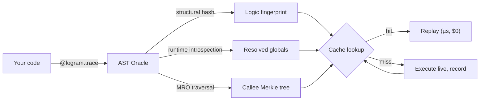

# Logram

**Step-level caching and replay for Python AI pipelines, keyed on a semantic fingerprint of the code.**


[](https://github.com/Mnemonic-Systems/logram/actions/workflows/ci.yml)
[](https://logram.dev/waitlist)

Logram records every traced step of a pipeline (inputs, outputs, object state, and the exact code and constants that produced them) in a local store. On the next run, each step is looked up by a fingerprint of its logic and arguments: if nothing relevant changed, the recorded output is replayed; otherwise the step runs live. Editing one prompt at step 97 re-executes only what depends on that edit.


*Iterating on a prompt in a VLM + LLM pipeline: unchanged steps replay from the store, only the edited step runs live.*

> **Installing with an AI agent?** Run `logram init` first, then have the agent read `LOGRAM_AGENT_RULES.md`.

---

## Contents

- [Motivation](#motivation)
- [What Logram is](#what-logram-is) · [What Logram is not](#what-logram-is-not)
- [Quickstart](#quickstart)
- [How it works](#how-it-works)
- [Agent interface (MCP)](#agent-interface-mcp)
- [Architecture](#architecture)
- [Guarantees, best practices and limitations](#guarantees-best-practices-and-limitations)
- [Related tools](#related-tools)
- [CLI reference](#cli-reference)
- [Advanced usage](#advanced-usage)
- [Design rationale](#design-rationale)
- [Status](#status)

---

## Motivation

Multi-step pipelines built on LLM or VLM calls are slow, costly and non-deterministic. Consider a pipeline that processes 150 image tiles through a VLM, where a logic error appears at step 97. Testing a fix today means:

1. **Waiting** about 4 minutes for steps 1–96 to re-execute.
2. **Paying** about $0.80 in API calls to reach the failure point again.
3. **Guessing**, since coding agents only see static source files, not what actually ran.

A fourth cost is less visible: every full re-run re-samples the upstream steps, so the effect of a change is **confounded** with sampling noise from steps that were never modified.

Freezing unchanged steps addresses all four.

| | Full re-run | Replay with Logram |
|---|---|---|
| Cost to validate a fix (150-tile VLM example) | ~$0.80 | ~$0.004 |
| Feedback latency | ~4 min | ~2 s |
| Upstream outputs | Re-sampled on every run | Identical to the baseline |
| Agent context | Static source files | Runtime traces, diffs, targeted replay |

---

## What Logram is

A decorator-based SDK (`@logram.trace`) that records a pipeline's logic, data flow and state, **entirely locally**, and provides four capabilities on top of that record:

1. **Logic fingerprinting.** Before a step runs, Logram computes a fingerprint of its code from the abstract syntax tree, the runtime values of the constants it reads, and the functions it calls, recursively. Formatting, comments, docstrings and Python-version changes do not affect it; semantic changes do.
2. **Replay.** Unchanged steps are replayed from a local SQLite store in about 1 ms. Only modified logic, and the steps that consume its new output, execute live.
3. **Divergence analysis.** When two runs disagree, Logram walks the call graph of both and reports exactly what changed, down to a prompt constant three levels deep, with a unified diff.
4. **Agent interface.** A native MCP server exposes the trace store to coding agents (Claude, Cursor), which can inspect what ran, locate the cause of a divergence, apply a change, validate it by replay, and check it against reference runs.

## What Logram is not

- **Not a monitoring or observability tool.** It is not designed for production: no latency dashboards, alerting or anomaly detection. Use LangSmith, Langfuse or Datadog for that. They observe the past; Logram is for iterating on the next version.
- **Not an evaluation or benchmarking framework.** Its golden-run feature answers one question: *did my change break the baseline?* It is a regression guard, not an accuracy measurement system. For metrics across hundreds of documents, use RAGAS, DeepEval or a custom harness.
- **Not an orchestration framework.** There are no DAG objects, retry policies or schedulers. Logram wraps existing code, whether it uses LangChain, LlamaIndex, Prefect or plain Python functions.
- **Not a coding-assistant plugin.** The MCP server does not write code or suggest completions. It gives the agent ground truth about the runtime: real prompts, real outputs, real logic diffs.

---

## Quickstart

```bash
pip install git+https://github.com/Mnemonic-Systems/logram.git
logram init    # writes agent rule files and updates .gitignore (commit them)
```

The MCP server and the dashboard API are optional: install `logram-sdk[mcp]`, `logram-sdk[server]` or `logram-sdk[all]`.
A runnable pipeline that needs no API key lives in [`examples/`](examples/).

```python
import logram

logram.init(project="invoice_agent", input_id="doc_42")

@logram.trace()
async def call_vlm(tile):
    return await gemini.generate(...)

@logram.trace()
async def extract_quantities(vlm_output):
    ...

await logram.finalize(status="success")
```

By default Logram only records. Replay is enabled with `LOGRAM_REPLAY=true`:

```bash
python my_pipeline.py                        # live run, populates the store
# edit a prompt, change a constant, rewrite a function
LOGRAM_REPLAY=true python my_pipeline.py     # unchanged steps replay, the edit runs live
logram replay my_pipeline.py                 # equivalent CLI shorthand
```

**Stateful pipelines**

```python
@logram.stateful(include=["results", "page_map"])
class InvoicePipeline:
    def __init__(self):
        self.results = {}
        self.page_map = {}

    @logram.trace()
    async def process_tile(self, tile):
        ...
```

**Inspect and diff**

```bash
logram inspect last               # step tree of the most recent run
logram diff last                  # last run vs previous run on the same input
logram diff --ss                  # last run vs last successful run on the same input
logram recover <logic_hash>       # exact code and prompts that ran
logram doctor                     # environment check
```

**Regression against reference runs**

```bash
logram golden add <run_id>        # mark a validated run as a reference
logram test my_pipeline.py        # replay all reference inputs, report regressions
```

Sync and async functions are both supported, with or without a framework. Token usage is extracted automatically from OpenAI, Anthropic and Gemini clients.

---

## How it works


```mermaid
flowchart LR
    A[Your code] -->|"@logram.trace"| B[AST Oracle]
    B -->|structural hash| C[Logic fingerprint]
    B -->|runtime introspection| D[Resolved globals]
    B -->|MRO traversal| E[Callee Merkle tree]
    C & D & E --> F{Cache lookup}
    F -->|hit| G["Replay (µs, $0)"]
    F -->|miss| H[Execute live, record]
    H --> F
```

### The logic fingerprint (AST Oracle)

The cache depends on one question: *did the logic change?* Hashing the source string fails on reformatting; hashing bytecode fails on Python upgrades. Neither change alters behaviour. The Oracle parses each traced function, walks its syntax tree, and produces a fingerprint that is stable against everything except a change in execution semantics:

```text
fingerprint = SHA-256(
    structural_AST            # cross-version stable
  ⊕ resolved_global_values    # runtime values, content-addressed
  ⊕ defaults / closures
  ⊕ callee_merkle_root        # Merkle aggregation over the call graph
)
```

| Layer | What it captures | Stability |
|---|---|---|
| Structural AST hash | Canonical tree: every node, operator and branch | Invariant to whitespace, comments, docstrings and `ast.unparse` formatting drift |
| Resolved globals | Runtime values of every constant the function reads (`dict`, `list`, `tuple`, `set`, `str`, `int`, `float`, `bool`), including reads inside lambdas, comprehensions and nested functions | Detects `CONFIG['temperature'] = 0.7 → 0.9` without any source change. Large containers are stored as a preview plus a digest of their full content, so a change anywhere invalidates |
| Closures and defaults | `__closure__` cell contents, positional and keyword defaults | Captures factory-built callables and parameter-baked configuration |
| Callee Merkle tree | Recursive hash of every user-space function reachable through the call graph | A change in a helper at depth 5 invalidates the parent, in O(N), cycle-safe, bounded at 256 nodes |
| Volatility markers | Deterministic tags for `eval`, `exec`, `compile`, dynamic `getattr` | Identical code gives an identical hash, even with dynamic constructs |

**Cross-version stability.** Upgrading from Python 3.10 to 3.13, reformatting with `black` or `ruff format`, adding docstrings or editing comments leaves the fingerprint unchanged. Only a semantic edit produces a new hash. The test suite pins a reference fingerprint that CI checks on every supported Python version.

**Method resolution.** Most caching engines treat `self.helper(x)` as opaque: `helper` is neither a global nor a closure. The Oracle recovers the enclosing class from `func.__qualname__`, walks the method resolution order (`cls.__mro__`), and resolves through `@classmethod`, `@staticmethod` and `@property`:

```python
class Pipeline:
    def parse(self, raw):          # edit this body...
        return clean(raw)

    def run(self, doc):
        parsed = self.parse(doc)   # ...and the cache for run() is invalidated
        return self.summarize(parsed)
```

**Constants by value, not by name.** The Oracle snapshots the runtime value of every constant a function reads when it is called, whatever the naming convention:

```python
temperature = 0.7              # captured
SYSTEM_PROMPT = "You are…"     # captured
modelName = "gpt-4o"           # captured
PROMPT_VARIANTS = ["a", "b"]   # captured deeply, not just by identity
```

Changing `temperature` or calling `PROMPT_VARIANTS.append("c")` both invalidate the cache.

**Deterministic volatility.** When a function uses `eval`, `exec` or a dynamic `getattr`, its behaviour cannot be proven statically. Engines typically either ignore the dynamic call (silent corruption) or add a time-based nonce (the cache never hits). Logram emits a deterministic marker instead:

```python
def dynamic(s):
    return eval(s)
# snapshot contains: <volatile:eval>
```

The marker is identical on every run, so the cache keeps working as long as the source is unchanged; adding or removing dynamic code invalidates it. Literal attribute access (`getattr(self, "name")`) is treated as a plain read; only `getattr(self, var_name)` produces `<volatile:getattr_dyn>`, so common idioms such as Pydantic field access do not poison the cache.

### Replay rules

A step's cache key combines its logic fingerprint, its arguments and, for stateful classes, the tracked object state.

- **Only successful steps are cached.** A step that failed (bug, rate limit, timeout, malformed LLM response) is never stored and always re-executes live. Transient errors retry; logic errors get fixed.
- **Outputs keep their types.** Pydantic models and dataclasses come back as instances, not dicts (see [Serialization](#serialization)).

### Stateful replay

Standard caching assumes pure functions, which methods that mutate instance state are not. `@logram.stateful` declares the attributes to track. On a live run, Logram stores the state delta after every traced method; on replay, it restores that state before returning the cached result, so the next step receives the state it expects.

```python
@logram.stateful(include=["detections", "page_map", "ocr_cache"])
class DocumentPipeline:
    ...
```

The state snapshot is a separate component of the cache key, not part of the logic fingerprint: code changes invalidate through the Oracle, state changes through `@stateful`.

### Divergence analysis

When a pipeline that worked yesterday breaks today, the question is not *what failed* but *what changed*. `analyze_logic_divergence` (and `logram diff`) performs an exhaustive walk of the logic registry, recursing through every callee resolved by the Oracle:

```text
step_name
  └── helper_fn              (depth 1) — no change
        └── build_prompt     (depth 2) — no change
              └── format_section (depth 3) — globals: SECTION_PROMPT_V2 changed
                    before: "Extract the quantities..."
                    after:  "Extract the quantities and units..."
```


---

## Agent interface (MCP)

Coding agents such as Claude and Cursor work from static source files. When a pipeline fails at step 97, the agent can read the code but not what actually ran. Logram's MCP server gives it access to the trace store, so it can:

- **Analyze**: identify failing runs, or read the exact runtime prompts of a successful baseline.
- **Navigate**: walk the recursive call graph to find where a prompt or helper is defined and called.
- **Experiment**: apply a change and validate it with a targeted replay, in about 2 s at no API cost.
- **Certify**: run the updated pipeline against reference runs to check that a fix for one input did not break others.

### Setup

```bash
pip install "logram-sdk[mcp]"
logram init          # writes the agent rule files below into your project
logram mcp install   # registers the MCP server with Claude Code, Cursor or Claude Desktop
logram mcp config    # or print the config block to add manually
```

| File written by `logram init` | Read by |
|---|---|
| `LOGRAM_AGENT_RULES.md` | Complete instrumentation rules (authoritative spec) |
| `.cursorrules` | Cursor, on every code generation |
| `CLAUDE.md` | Claude Code, at session start |

These files tell the agent how to instrument the pipeline, what to exclude from the cache and what never to touch. Commit them with your code.

Manual configuration (`~/.cursor/mcp.json` or Claude Desktop config):

```json
{
  "mcpServers": {
    "logram": {
      "command": "logram",
      "args": ["mcp", "start"]
    }
  }
}
```

### Tools

| Tool | When to use |
|---|---|
| `list_runs(project)` | First call in a debugging session; returns run IDs |
| `get_investigation_brief(run_id)` | Triage of a failed run: step, error, logic hash |
| `get_step_source(logic_hash)` | Exact code and prompts that ran at failure time |
| `analyze_logic_divergence(run_id_a, run_id_b)` | What changed between two runs, recursively |
| `compare_step_data(run_id_a, run_id_b, step_name)` | Diff runtime inputs and outputs when logic is identical |
| `run_surgical_replay(script_path)` | Validate a fix in ~2 s; only modified steps run live |
| `verify_against_golden_dataset(project, script_path)` | Check for regressions before closing a bug |

`run_surgical_replay` enforces three safety gates:

- **Path jail**: only `.py` files inside the current working directory.
- **Circuit breaker**: at most 5 replays per agent session, to bound API cost.
- **Logic guard**: aborts if the logic hash has not changed since the last failure.

---

## Architecture

### Local-first storage

All trace data lives in a SQLite database on your machine. Binary payloads (images, PDFs) are stored as content-addressed blobs: an image tile sent to 150 VLM calls is stored once. Nothing leaves the machine.

```
.logram/
  logram.db            # runs, steps, logic_registry, values_registry
.logram_assets/
  <sha256>.bin         # deduplicated binary blobs
```

WAL mode is enabled by default, so `logram inspect` can run while a pipeline is writing.

### Framework-agnostic

Logram instruments plain Python functions with a decorator, with no framework lock-in: any LLM client (OpenAI, Gemini, Anthropic, with automatic token-usage extraction), any orchestration layer (LangChain, LlamaIndex, or none), sync and async.

### Zero runtime impact

Three guarantees:

- **It never crashes your pipeline.** Every tracing operation runs inside a catch-all. If the database is unavailable, serialization fails or introspection throws, the original function is called unchanged.
- **It never blocks your pipeline.** All SQLite writes happen in a background daemon thread. In live mode, the cache lookup is skipped entirely.
- **It is transparent to your type system.** `@logram.trace` uses `@functools.wraps`, preserving `__name__`, `__qualname__`, `__doc__` and the signature.

<details>
<summary>Implementation details</summary>

**Zero-crash contract** (`decorators.py`):

```python
try:
    ctx = _prepare_step_ctx(...)
except Exception:
    return await func(*args, **kwargs)  # tracing failed, pipeline continues
```

**Background writes.** Writes are enqueued with `queue.put_nowait()` into a daemon thread that flushes to SQLite in batches of up to 50 items every 500 ms. The queue holds 50,000 items; if it fills, writes are dropped rather than applying backpressure.

**Oracle memoization.** The fingerprint is computed once per function per run and cached in a `WeakKeyDictionary`: a step called 150 times pays the analysis cost once. The cache is cleared at `logram.init()` to pick up source edits between runs.

</details>

### Serialization

Every step output is captured and rehydrated to its original type on replay.

1. **Capture.** `ensure_serializable` converts any object to a JSON-safe tree, tagging typed objects with their class and module path.
2. **Store.** The tree goes to SQLite; binary data goes to `.logram_assets/`, keyed by SHA-256 and written once.
3. **Rehydrate.** On a cache hit, tagged objects are reconstructed by dynamic import: `model_validate` for Pydantic, `cls(**state)` with nested coercion for dataclasses.

| Type | Stored as |
|---|---|
| Pydantic model (v1 / v2) | Tagged dict `{__af_kind__: "pydantic", __af_model__: ..., state: {...}}` |
| `@dataclass` | Tagged dict `{__af_kind__: "dataclass", __af_model__: ..., state: {...}}` |
| `bytes` / `bytearray` | Content-addressed blob, never stored twice |
| `UUID`, `Path`, `datetime`, `Decimal`, `Enum` | Native string representation |
| `dict`, `list`, `tuple`, `set`, `frozenset` | Recursive JSON tree |
| Anything else | `str(obj)`: the cache key stays valid, the type is not reconstructed |

### Run versioning

Each run is stamped with an identifier derived from the git state, with no configuration:

- clean repository: `<commit_short>`, e.g. `3f9a2c8`;
- dirty working tree: `<commit_short>-dirty-<md5_6_of_changes>`, e.g. `3f9a2c8-dirty-a4f91c` (the `.logram` directory is excluded from the hash).

When a bug appears on a feature branch but not on `main`, runs can be compared directly:

```
logram list --project my_agent
# run_abc  ·  3f9a2c8            ·  main       ·  SUCCESS  ·  0.004s
# run_xyz  ·  4d1b7e2-dirty-...  ·  feature/…  ·  FAILED   ·  1.201s

logram diff run_abc run_xyz --code --globals
```

---

## Guarantees, best practices and limitations

Logram tracks data flow, not system resources. The Oracle traces the code you write, not the code Python generates at runtime. The following rules make the difference between good and exact replays.

### 1. Return data, not resources

Avoid returning open files, sockets, database connections or non-yielding generators from a traced step. A non-serializable output is stored as `str(obj)`, so on replay the next step receives a string. Return dicts, Pydantic models or dataclasses.

**Streaming outputs** (generators and async generators) are supported natively. During a live run, Logram captures each yielded chunk without adding latency. The cache is written only if the stream is fully consumed (a premature `break` creates no entry), and on replay the stored chunks are re-yielded:

```python
@logram.trace
async def stream_llm(prompt: str):
    async for chunk in client.chat(prompt, stream=True):
        yield chunk

async for part in stream_llm("Hello"):   # identical usage, live or replayed
    print(part)
```

### 2. Typed outputs give exact rehydration

Serialization is tag-based: class metadata is embedded at capture time, so no type annotation is required on the traced function. Return Pydantic models or dataclasses to get typed objects back on replay; plain dicts work but lose type reconstruction.

```python
@logram.trace
def extract_quantities(page: Page) -> ExtractionResult:
    ...
    return ExtractionResult(tiles=tiles, totals=totals)
    # replay returns an ExtractionResult instance, not a dict
```

### 3. Give custom objects a stable identity

Arguments follow a different path from code. Primitives, containers, Pydantic models and dataclasses get content-based keys automatically (every element counts; long strings and bytes are hashed). Other classes fall back to `repr()`, which often contains a memory address that changes every run and defeats replay. Implement `__logram_trace_key__`:

```python
class ImageTile:
    def __logram_trace_key__(self):
        return {"tile_id": self.tile_id}
```

At runtime, Logram detects address-based reprs and warns: `[PROBE 2][UNSTABLE_REPR] type=ImageTile … Fix: implement __logram_trace_key__ on this class.`

### 4. Treat configuration as immutable within a run

Constants are snapshotted when a function is first called in a run. A global mutated *inside* a traced function during a run is detected on the next run, not by later steps of the same run. Pass dynamic values as arguments, or manage shared mutable state with `@stateful`.

### 5. Distributed execution

Context variables, including the current `run_id`, do not cross process boundaries. Without intervention, worker processes write to a shared default run. Use `logram.worker_init` as the pool initializer:

```python
run_id = logram.init(project="my_pipeline", input_id="doc_42")

with ProcessPoolExecutor(initializer=logram.worker_init, initargs=(run_id,)) as pool:
    results = list(pool.map(process_tile, tiles))
```

`worker_init` sets the context in each worker without calling `logram.init()` again; the SQLite store is shared on disk and WAL mode handles concurrent writes. On Linux, where `fork` is the default, prefer `spawn` or `forkserver` to avoid sharing the parent's SQLite connection:

```python
import multiprocessing
multiprocessing.set_start_method("spawn")
```

### 6. What triggers a re-run

The Oracle errs on the side of re-execution rather than stale cache.

**Invariant (no false invalidation)**

- Comments, whitespace, blank lines, docstrings.
- `black` / `ruff` reformatting.
- Python minor-version upgrades (3.10 → 3.13).

**Invalidates correctly**

- Editing a function body (structural AST hash), including renaming a parameter or changing a type annotation.
- Changing a constant value (runtime global resolution), wherever it sits in a container.
- Modifying a callee at any depth of the user-space call graph (Merkle aggregation).
- Changing a method called through `self.method()` (MRO traversal).
- Adding or removing `eval`, `exec` or dynamic `getattr` (volatility markers).

**Known blind spots**

<details>
<summary><strong>Imports inside a function body</strong></summary>

```python
def fn(x):
    import math            # local binding
    return math.pi * x     # seen as __local__:math.pi, filtered
```

Constants from inline-imported modules are not captured as resolved globals. Editing the function itself still invalidates it; only changes to the imported module's constants are invisible. Move imports to the top of the file (as `ruff E402` also recommends).

</details>

<details>
<summary><strong>Objects stored in globals</strong></summary>

Built-in values (`dict`, `list`, `str`, numbers…) read from a global are captured by content. Any other object read as a whole (a config class instance, a NumPy array) is captured by type only:

```python
SETTINGS = Settings(temperature=0.7)

def fn(x):
    return call_llm(x, SETTINGS)    # SETTINGS captured as "Settings", not by value
```

Attribute reads are resolved (`SETTINGS.temperature` in the body is captured by value). Otherwise pass the object as an argument, where it is keyed by content (Pydantic, dataclass) or by `__logram_trace_key__`.

</details>

<details>
<summary><strong>Truly dynamic dispatch</strong>: <code>getattr(self, var_name)</code>, <code>globals()[key]</code></summary>

The dispatch site is tracked through `<volatile:getattr_dyn>`, but the resolved callee depends on runtime data and is invisible to the Merkle tree. Make the dynamic element explicit in the cache key:

```python
@logram.trace(vcr_key_fn=lambda fn, args, kwargs: (args, kwargs, type(args[0]).__name__))
async def dispatch_step(self, payload):
    method = getattr(self, f"_handle_{payload.type}")
    return await method(payload)
```

</details>

<details>
<summary><strong>Very deep call graphs</strong>: more than 256 user-space callees</summary>

The callee Merkle tree is bounded at 256 unique user-space functions per traced step to keep hashing time predictable. Real pipelines reach 30–80. When the budget is hit, a `[Logram][oracle] callee budget exhausted` warning shows where it stopped. To raise it:

```python
import logram.oracle
logram.oracle._CALLEE_BUDGET = 1024
```

</details>

---

## Related tools

Each tool below is good at what it does; Logram answers a different question: *how cheaply can a fix be validated?*

| | Logram | LangSmith / Langfuse | Dagster / Prefect | pytest + mocks |
|---|---|---|---|---|
| Primary purpose | Iteration speed | Observability, evals | Orchestration | Unit testing |
| Replay only changed logic | ✓ | – | – | – |
| Capture prompts at runtime | ✓ | Partial | – | – |
| Stateful object replay | ✓ | – | – | – |
| Recursive logic diff over the call graph | ✓ | – | – | – |
| MRO-aware method tracking | ✓ | – | – | – |
| Cross-Python-version stable hash | ✓ | n/a | n/a | n/a |
| Native MCP agent interface | ✓ | – | – | – |
| Fully local | ✓ | – | ✓ | ✓ |
| Cost to validate a fix (150-tile example) | ~$0.004 | ~$0.80 | ~$0.80 | $0 (mocked, not real) |
| Time to validate a fix | ~2 s | ~4 min | ~4 min | seconds (mocked) |

`pytest` validates a frozen surface and LangSmith records what happened; Logram lets you change one prompt and check the new behaviour against the real model, on the real inputs.

---

## CLI reference

The CLI is built on [Typer](https://typer.tiangolo.com/) and [Rich](https://rich.readthedocs.io/): step trees, syntax-highlighted code, unified diffs and progress bars in the terminal.

| Command | Description |
|---|---|
| `logram list` | List runs with status, duration, relative time |
| `logram inspect <run_id>` | Step tree with status badges (accepts `last`, `last-failed`, `-1`, `-2`…) |
| `logram view <step_id>` | Inputs, output, error and blobs of one step |
| `logram recover <logic_hash>` | Runtime source code and globals for a fingerprint |
| `logram replay <script.py>` | Replay (`--force`, `--from`) |
| `logram diff <run_a> <run_b>` | Code, globals, inputs, outputs (`--code`, `--globals`, `--inputs`, `--outputs`) |
| `logram diff last` / `--ss` | Last run vs previous run / vs last success, same `input_id` |
| `logram golden add <run_id>` | Mark a run as a reference |
| `logram test <script.py>` | Regression test against reference runs |
| `logram restore <run_id>` | Print copy-pasteable code blocks to revert to a run |
| `logram stats` | Time, tokens and cost saved by replay |
| `logram open <step_id>` | Open a step's image blob in the system viewer |
| `logram clean` | Interactive cleanup of failed runs and orphan assets |
| `logram doctor` | Environment check: Python, database, MCP wiring, orphan blobs |
| `logram live` | Live step tree, polls every 500 ms (`--interval`) |
| `logram ui` | Local web dashboard API server |
| `logram mcp start` / `config` / `install` | Launch, print config for, or register the MCP server |

<details>
<summary><strong>Replay</strong>: <code>logram replay</code></summary>

Reruns the pipeline with `LOGRAM_REPLAY=true`: unchanged steps replay, modified steps run live.

```bash
logram replay my_pipeline.py                            # standard replay
logram replay my_pipeline.py --force call_vlm           # force one step live (invalidates its cache)
logram replay my_pipeline.py --from extract_quantities  # run this step and everything downstream live
logram replay my_pipeline.py -f step_a -f step_b        # force several steps live
```

The CLI prints which steps are forced live, invalidates their cached rows before launching, streams the subprocess output, and ends with a success or failure badge and a hint for the next command.

</details>

<details>
<summary><strong>Diff</strong>: <code>logram diff</code></summary>

Compares two runs across four dimensions and renders:

1. a summary table, one row per step, with `logic_hash`, `source`, `globals` and `callees` marked `identical`, `changed` or `same`;
2. unified diffs for every dimension that changed;
3. a callee tree for steps whose deep dependencies changed (callee, depth, what changed).

```bash
logram diff run_20260425_142211 run_20260425_150033   # full diff
logram diff last                                      # last run vs previous, same input_id
logram diff --ss                                      # last run vs last success, same input_id
logram diff <run_a> <run_b> --code                    # source only
logram diff <run_a> <run_b> --globals                 # prompts and constants only
logram diff <run_a> <run_b> --inputs                  # runtime inputs only
logram diff <run_a> <run_b> --outputs                 # runtime outputs only
```

```text
diff  ·  run_a → run_b

step                logic_hash   source   globals   callees
extract_quantities  changed      same     same      build_prompt +1

callee tree  ·  extract_quantities  ·  2 node(s) changed
└── build_prompt  depth 1  globals:EXTRACTION_PROMPT_V3
    └── extract_quantities → build_prompt
```

</details>

<details>
<summary><strong>Investigation</strong>: <code>list</code>, <code>inspect</code>, <code>view</code>, <code>recover</code></summary>

```bash
logram list                                      # all runs, newest first
logram list --project my_agent                   # filter by project
logram list --group-by-input                     # group by input_id
logram list --copy-field run_id --copy-index 1   # copy the first run_id to the clipboard

logram inspect last          # most recent run
logram inspect last-failed   # most recent failed run (alias: fail)
logram inspect -1            # most recent (-2 = second-to-last, …)
```

Tab completion (`logram --install-completion`) suggests real run IDs alongside the shorthands.

```text
my_agent  ·  2026-04-25 14:22:11  ·  success

my_agent
├── ✓ load_pdf            0.012s   SUCCESS
├── ✓ split_tiles         0.044s   SUCCESS
├── ⏭ call_vlm           [×150]   REPLAYED
├── ✗ extract_quantities  1.201s   FAILED
└── · aggregate_results   —        SKIPPED

Total: 1.26s   Live: 1.26s   Replayed: 150 steps
```

`logram view <step_id>` shows inputs, output and error as highlighted JSON, with binary outputs listed by hash, size and path. `logram recover <logic_hash>` shows the exact source and globals that were active for a fingerprint: what actually ran, not what the file says today.

</details>

<details>
<summary><strong>Regression</strong>: <code>golden</code>, <code>test</code>, <code>restore</code></summary>

```bash
logram golden add run_20260425_142211
logram test my_pipeline.py
```

```text
golden test  ·  my_pipeline.py  ·  3 input(s)

input_id          baseline         new run          result     details
doc_invoice_42    run_20260420...  run_20260425...  ✓ SUCCESS  no regression
doc_invoice_87    run_20260420...  run_20260425...  ✗ FAILED   2 step(s) differ
doc_invoice_103   run_20260420...  run_20260425...  ✓ SUCCESS  no regression
```

`logram test` replays the script once per reference input, with `LOGRAM_INPUT_ID` set to that input (`logram.init()` uses it as the run's `input_id`; the script should load the matching document, e.g. `os.environ.get("LOGRAM_INPUT_ID", "doc_42")`). Every call of every step is compared, and the command exits with code 1 on any regression, so it can run in CI. `logram restore <run_id>` prints all source blocks and global snapshots of a run as copy-pasteable panels, to revert a function manually to a known-good state.

</details>

<details>
<summary><strong>Metrics</strong>: <code>stats</code></summary>

```bash
logram stats                         # global
logram stats --project my_agent      # one project
logram stats <run_id>                # one run
logram stats --hourly-rate 150       # custom rate for the cost estimate
```

```text
stats  ·  global  ·  47 run(s)  ·  6 820 steps (6 521 replayed)

metric                  value
Resource time saved     2h 14m 33s
Total compute time      2h 21m 08s
Efficiency ratio        95.3%
Financial gain (est.)   33.60 €

tokens              value
Spent (live)        124 820
Saved (cache)       2 643 100
Bypass rate         95.5%
```

</details>

<details>
<summary><strong>Maintenance and UI</strong>: <code>clean</code>, <code>open</code>, <code>ui</code>, <code>doctor</code>, <code>live</code></summary>

- `logram clean` lists failed runs and orphan blobs (assets no longer referenced by any step) and asks before deleting.
- `logram open <step_id>` opens a step's image blob in the system viewer, useful to see what a VLM actually received.
- `logram ui` launches a local read-only FastAPI server for the web dashboard (`--port`, `--no-open-browser`).
- `logram doctor` checks Python version, SDK installation, the `.logram/` directory and database, MCP wiring for Claude Code, Claude Desktop and Cursor, and pending cleanup.
- `logram live` shows a live-updating step tree of the running pipeline (`--interval`, minimum 100 ms); run it in a split terminal.

```text
logram doctor

  check                status     detail
  Python               ✓ ok       3.12.3
  Logram SDK           ✓ ok       0.3.0
  .logram/             ✓ ok       /path/to/.logram
  logram.db            ✓ ok       142 KB · 12 run(s)
  Claude Code MCP      ✓ ok       logram found in ~/.claude.json
  Claude Desktop MCP   – n/a      not supported on this platform
  Cursor MCP           ⚠ warn     found mcp.json but logram not wired
  Cleanup              ⚠ warn     3 failed run(s) · 1 orphan blob(s)
```

</details>

---

## Advanced usage

<details>
<summary><strong><code>vcr_key_fn</code></strong>: custom cache key</summary>

By default, all named arguments enter the cache key. For custom objects this can cause **false misses**: fields that change between runs without affecting the output (a counter, an embedded timestamp) change the key every time. `vcr_key_fn` pins the key to the fields that define identity. It is also the only option for third-party classes you cannot modify.

```python
# Own class: key on identity fields only (args[0] = self, args[1] = tile)
@logram.trace(vcr_key_fn=lambda func, args, kwargs: (
    {"tile_id": args[1].tile_id, "page": args[1].page_number}, {}
))
async def process_tile(self, tile: ImageTile) -> dict:
    ...  # the 80 KB image_bytes are not part of the key

# Third-party class
from langchain.schema import Document

@logram.trace(vcr_key_fn=lambda func, args, kwargs: ({"page_content": args[0].page_content}, {}))
def extract_entities(doc: Document) -> list[str]: ...
```

The function receives `(func, args, kwargs)`, with positional arguments as-is (including `self`), and returns `(vcr_args, vcr_kwargs)`; a single return value is paired with `{}`.

</details>

<details>
<summary><strong><code>ignore_in_hash</code></strong>: exclude volatile arguments</summary>

Request IDs, timestamps and tracing contexts change on every call without affecting the output; leaving them in the key guarantees a miss.

```python
@logram.trace(ignore_in_hash=["timestamp", "request_id", "trace_ctx"])
async def classify(self, text: str, timestamp: float, request_id: str) -> str: ...
```

**Diagnostic:** if a step keeps running live in replay mode, look for `[PROBE 3][HashComponents]` in the logs. A field of `COMPONENT_args_repr` that differs between runs but should not matter belongs in `ignore_in_hash`.

</details>

<details>
<summary><strong><code>log_input_fn</code></strong>: custom input logging</summary>

Stores a focused or human-readable summary of the inputs instead of the default serialization. It affects display only, not the cache key (use `vcr_key_fn` for that).

```python
def _summarize_tile_input(func, args, kwargs):
    tile = kwargs.get("tile")
    return {"tile_id": tile.tile_id, "page": tile.page_number,
            "bbox": tile.bbox, "image_size_kb": len(tile.image_bytes) // 1024}

@logram.trace(log_input_fn=_summarize_tile_input)
async def process_tile(self, tile: ImageTile) -> dict: ...
```

</details>

<details>
<summary><strong><code>@logram.stateful</code>, <code>state_in_hash</code>, <code>include_state</code>, <code>exclude_state</code></strong>: state control</summary>

`@stateful(include=[...])` declares the attributes a class accumulates across traced calls; they are snapshotted before and after each call and restored on replay. By default the state enters the cache key, which is correct when the same arguments with different state can give different results.

```python
@logram.stateful(include=["results", "page_map", "ocr_cache", "font_registry"])
class DocumentPipeline:

    @logram.trace(include_state=["page_map"])       # only page_map enters this key
    async def resolve_page(self, page_id: int) -> dict: ...

    @logram.trace(exclude_state=["font_registry"])  # all fields except font_registry
    async def extract_text(self, tile: ImageTile) -> str: ...

    @logram.trace(state_in_hash=False)              # method never reads self.*
    async def format_output(self, raw: dict) -> str: ...
```

</details>

<details>
<summary><strong><code>track_args</code></strong>: in-place argument mutations</summary>

A step that fills a mutable argument and returns `None` would replay `None` without restoring the mutation, leaving downstream steps with wrong data. `track_args` stores and restores the delta, through the same `values_registry` as `@stateful`.

```python
@logram.trace(track_args=["accumulator"])
async def aggregate_results(self, items: list, accumulator: dict) -> None:
    for item in items:
        accumulator[item["id"]] = item["value"]
```

</details>

<details>
<summary><strong><code>__logram_trace_key__</code> and <code>__logram_trace_log__</code></strong>: object identity protocols</summary>

`__logram_trace_key__` controls the cache key of a custom object; `__logram_trace_log__` controls what is stored and displayed (`logram view`, `logram diff`) without affecting caching. If only the first is defined, it is used for both.

```python
class ImageTile:
    def __logram_trace_key__(self):
        return {"tile_id": self.tile_id, "page": self.page_number}

    def __logram_trace_log__(self):
        return {"tile_id": self.tile_id, "page": self.page_number, "bbox": self.bbox,
                "image_size_kb": len(self.image_bytes) // 1024, "grid_tag": self.grid_tag}
```

The key must be stable across runs (no addresses, no timestamps) and change when the object's logical identity changes.

</details>

<details>
<summary><strong>Run lifecycle</strong>: tags, <code>flush</code>, <code>finalize</code></summary>

Tags categorize runs; `GOLDEN` is the tag behind `logram golden add` and `logram test`.

```python
run_id = logram.init(project="invoice_agent", run_name="batch_run",
                     input_id=document_id, tags=["GOLDEN", "staging", "v2-prompt"])
try:
    await run_pipeline()
    await logram.finalize(status="success", metrics={"pages": 12})
except Exception:
    await logram.finalize(status="failed")
    raise
```

Writes are asynchronous, so short scripts can exit before the queue is flushed: always call `finalize()`, which closes the run, computes metrics and waits for pending writes. `flush()` persists without closing, for checkpoints in long pipelines. Metrics passed to `finalize()` appear in `logram stats`.

</details>

<details>
<summary><strong>Web servers and external run IDs</strong>: <code>bind_session_run</code>, <code>with_session_run</code>, <code>set_run_id</code></summary>

In a FastAPI-style server, each request can be traced as its own run with a stable ID derived from the session rather than a random UUID:

```python
@app.post("/analyze")
async def analyze(session: Session = Depends(get_session)):
    logram.bind_session_run(session, prefix="analyze", session_id_attr="id")
    result = await run_pipeline(session)
    await logram.finalize(status="success")
    return result

@logram.with_session_run(prefix="analyze", session_id_attr="id")
async def analyze(session: Session): ...

# Custom resolver for any session shape
logram.bind_session_run(session, resolver=lambda s: f"req_{s.correlation_id}_{s.user_id}")
```

When the run ID comes from an orchestrator or job queue:

```python
logram.set_run_id(f"job_{os.environ['JOB_ID']}", verbose=True)
```

</details>

<details>
<summary><strong><code>LOGRAM_FORCE_STEP</code> and <code>LOGRAM_FORCE_FROM</code></strong>: replay control</summary>

`LOGRAM_FORCE_STEP` invalidates the cached success of named steps so they run live. Do not use it on failed steps: they have no cache entry and already run live, and doing so triggers the MCP logic guard. `LOGRAM_FORCE_FROM` runs a step and everything downstream live, while still replaying everything upstream.

```bash
LOGRAM_REPLAY=true LOGRAM_FORCE_STEP=call_vlm python my_pipeline.py
LOGRAM_REPLAY=true LOGRAM_FORCE_FROM=extract_quantities python my_pipeline.py
```

| | `FORCE_STEP` | `FORCE_FROM` |
|---|---|---|
| Target step | Live | Live |
| Upstream steps | Replayed | Replayed |
| Downstream steps | Replayed | Live |
| Use when | The fix does not change the step's output for downstream steps | The fix changes data consumed downstream |

</details>

<details>
<summary><strong>Environment variables</strong></summary>

| Variable | Default | Description |
|---|---|---|
| `LOGRAM_REPLAY` | `""` | `"true"` enables replay: every step with a cached success replays |
| `LOGRAM_FORCE_STEP` | `""` | Comma-separated steps to force live; invalidates their cache |
| `LOGRAM_FORCE_FROM` | `""` | Step from which execution cascades live |
| `LOGRAM_DB_PATH` | `.logram/logram.db` | Database location (shared store, CI artifact path) |
| `LOGRAM_PROJECT_ROOT` | auto-detected | Root for blob storage, detected from `pyproject.toml` / `.git`; set it in Docker or monorepos |
| `LOGRAM_INPUT_ID` | `""` | Override the run's `input_id` (used by `logram test`) |

</details>

---

## Design rationale

Observability tools are built for production: they surface anomalies in deployed systems. That is essential for maintenance but does not help build a better system. Logram targets the development loop, where the bottleneck, both for improving performance and fixing logic, is the cost of verifying each change: the latency and API calls needed to re-execute successful upstream steps just to reach the logic being tuned.

Reducing that cost to seconds changes how pipelines get built:

- **Prototyping.** Several prompt variants or logic structures can be tested against the same historical context in minutes.
- **Controlled comparisons.** Sub-components are tuned on real historical inputs, with everything upstream held fixed.
- **Regression-free upgrades.** An improvement for one edge case is checked against all reference runs before it lands.

---

## Status

| Capability | Status |
|---|---|
| AST-based, cross-Python-version stable fingerprinting | Available |
| MRO-aware method resolution | Available |
| SQLite WAL mode (concurrent access) | Available |
| Content-addressed blob deduplication | Available |
| MCP server for agents | Available |
| Git-based run versioning | Available |
| Golden-run regression suite | In progress |
| Web dashboard | In progress ([waitlist](https://logram.dev/waitlist)) |
| Cloud sync of reference runs | Roadmap |

If Logram is useful to you, a star on the repository helps.

## License

MIT, see [LICENSE](LICENSE).
