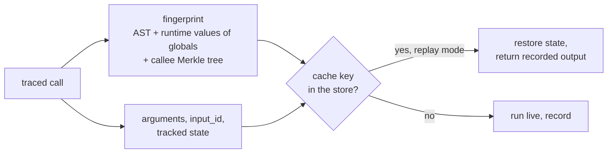

# Logram

**Step-level caching and replay for Python AI pipelines, keyed on a semantic fingerprint of the code.**


[](https://github.com/Mnemonic-Systems/logram/actions/workflows/ci.yml)

Logram records every traced step of a pipeline (inputs, outputs, object state, and the exact code and constants that produced them) in a local store. On the next run, each step is looked up by a fingerprint of its logic and arguments: if nothing relevant changed, the recorded output is replayed; otherwise the step runs live. Editing one prompt at step 97 re-executes only what depends on that edit.


*Iterating on a prompt in a VLM + LLM pipeline: unchanged steps replay from the store, only the edited step runs live.*

## Why

Validating a change to a multi-step LLM pipeline usually means re-running everything upstream of it: minutes of waiting, API cost, and fresh samples from steps that were never modified, so the effect of the change is confounded with sampling noise. Logram freezes what did not change and runs only what did, against the real model and the real inputs.

It is a development tool, not a production one: not an observability platform, an evaluation framework or an orchestrator ([positioning](docs/design.md)).

## Try it in 30 seconds

No API key needed: the example pipeline uses a fake model that sleeps like a real one.

```bash
git clone https://github.com/Mnemonic-Systems/logram.git && cd logram
pip install .
python examples/invoice_pipeline.py                      # live run, ~4 s
LOGRAM_REPLAY=true python examples/invoice_pipeline.py   # everything replayed, ~20 ms
logram inspect last
```

Then edit `SUMMARY_PROMPT` in the example and replay again: only the summary step runs live ([walkthrough](examples/)).

## Use it in your project

Logram is installed from this repository (it is not published on PyPI; a different project named `logram` is):

```bash
pip install "git+https://github.com/Mnemonic-Systems/logram.git"
```

```python
import asyncio
import logram

@logram.trace()
def call_vlm(tile):
    return client.generate(...)

@logram.trace()
def extract_quantities(vlm_output):
    ...

async def main():
    logram.init(project="invoice_agent", input_id="doc_42")
    extract_quantities(call_vlm(tile))
    await logram.finalize(status="success")

asyncio.run(main())
```

```bash
python pipeline.py                        # live run, records every step
# edit a prompt, a constant, a helper…
LOGRAM_REPLAY=true python pipeline.py     # unchanged steps replay, the edit runs live
logram inspect last                       # step tree: what replayed, what ran
logram diff last --globals                # what changed, down to the prompt
```

Sync and async functions, generators, stateful classes (`@logram.stateful`) and multiprocessing are supported; token usage is read from OpenAI, Anthropic and Gemini responses.

## How it works


```mermaid
flowchart LR
    A[traced call] --> B[fingerprint<br/>AST + runtime values of globals<br/>+ callee Merkle tree]
    A --> C[arguments, input_id,<br/>tracked state]
    B & C --> K{cache key<br/>in the store?}
    K -->|yes, replay mode| R[restore state,<br/>return recorded output]
    K -->|no| L[run live, record]
```

- **Logic fingerprint.** The function's canonical AST (invariant to formatting, comments, docstrings and Python version), the runtime values of every global it reads (prompts, config dicts, regexes, dataclass and Pydantic config objects…), its closures and defaults, and recursively the fingerprints of the project functions it calls, including methods reached through `self` and methods of objects it creates.
- **Cache key.** Fingerprint + every element of the arguments + the run's `input_id` + the tracked object state. Only successful steps are cached; outputs are rehydrated to their original types.
- **Zero-crash.** Any failure in Logram itself falls back to calling your function unchanged; writes happen on a background thread.

Details: [how it works](docs/how-it-works.md).

## Is it sound, and what does it cost?

A [mutation benchmark](benchmarks/) applies every single-point mutation (constant, arithmetic or comparison operator) to a corpus of pipeline-like steps and compares each step's **actual output** with its fingerprint. An output that changes while the fingerprint does not is a stale replay.

| | v0.3.0 | v0.4.0 |
|---|---|---|
| stale replays (false hits) out of 111 behaviour changes | 18 (16.2%) | **0** |
| unneeded reruns out of 1,280 unchanged outputs (upper bound) | 1.0% | 1.6% |
| cosmetic edits that keep every fingerprint | 647 / 663 | **663 / 663** |

The benchmark runs in CI. On a laptop, a traced call costs about 50 µs in live mode and a replayed step about 0.2 ms; fingerprinting a function costs about 0.2 ms, once per run ([numbers and method](benchmarks/README.md)).

## Limitations

The fingerprint covers the code under your project directory and the values it reads. It does not see: library upgrades or provider-side model changes, data read from files at runtime (prompts in YAML/JSON), objects created elsewhere and held in attributes (`self.client`), truly dynamic dispatch (`getattr(self, name)`), or imports inside function bodies. Each has a workaround (pass the data as an argument, `vcr_key_fn`, `LOGRAM_FORCE_STEP`); see [guarantees and limitations](docs/limitations.md).

## Agent interface

A local MCP server lets coding agents (Claude Code, Cursor) read what actually ran, locate what changed between two runs, validate a fix by replay and check it against reference runs. Install it with `pip install "logram-sdk[mcp] @ git+https://github.com/Mnemonic-Systems/logram.git"`, then run `logram init && logram mcp install`. See [agent interface](docs/mcp.md).

## Documentation

Changes between versions are listed in the [changelog](CHANGELOG.md).


- [How it works](docs/how-it-works.md): fingerprint, cache key, stateful replay, divergence analysis, storage, serialization.
- [Guarantees and limitations](docs/limitations.md): what triggers a rerun, known blind spots, multiprocessing.
- [CLI reference](docs/cli.md): `inspect`, `diff`, `replay`, `test`, `stats`, `doctor`…
- [Advanced usage](docs/advanced.md): `ignore_in_hash`, `vcr_key_fn`, `@stateful`, `track_args`, run lifecycle, web servers, environment variables.
- [Agent interface (MCP)](docs/mcp.md) · [Design and positioning](docs/design.md) · [Benchmarks](benchmarks/README.md)

## Development

```bash
pip install -e ".[dev]"
pytest                                   # unit, end-to-end, multiprocessing and benchmark tests
ruff check logram tests examples benchmarks
mypy
python benchmarks/mutation_soundness.py
```

CI runs the tests on Python 3.10–3.13 on Linux and macOS, and installs the built wheel without extras.

## Status

Alpha. The SDK, CLI and MCP server are usable; a web dashboard for the read-only API behind `logram ui` is in progress.

## License

MIT, see [LICENSE](LICENSE).
