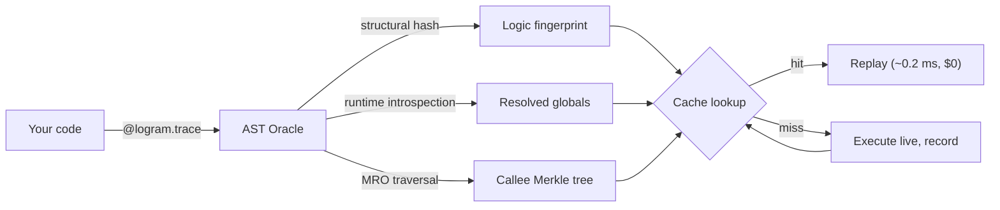

# How it works

Before a traced step runs, Logram computes a **cache key** from the step's
logic fingerprint, its arguments, the run's `input_id` and, for stateful
classes, the tracked object state. In replay mode, a key already recorded for
a successful step is served from the store; anything else runs live and is
recorded.



### The logic fingerprint (AST Oracle)

The cache depends on one question: *did the logic change?* Hashing the source string fails on reformatting; hashing bytecode fails on Python upgrades. Neither change alters behaviour. The Oracle parses each traced function, walks its syntax tree, and produces a fingerprint that is stable against everything except a change in execution semantics:

```text
fingerprint = SHA-256(
    structural_AST            # cross-version stable
  ⊕ resolved_global_values    # runtime values, content-addressed
  ⊕ defaults / closures
  ⊕ callee_merkle_root        # Merkle aggregation over the call graph
)
```

| Layer | What it captures | Stability |
|---|---|---|
| Structural AST hash | Canonical tree: every node, operator and branch | Invariant to whitespace, comments, docstrings and `ast.unparse` formatting drift |
| Resolved globals | Runtime values of every global the function reads, including reads inside lambdas, comprehensions and nested functions: builtins (`dict`, `list`, `str`, numbers…), compiled regexes, enums, dates, dataclass and Pydantic instances, `functools.partial` arguments; `self.CONSTANT` class attributes | Detects `CONFIG['temperature'] = 0.7 → 0.9` without any source change. Large containers are stored as a preview plus a digest of their full content, so a change anywhere invalidates |
| Closures and defaults | `__closure__` cell contents, positional and keyword defaults | Captures factory-built callables and parameter-baked configuration |
| Callee Merkle tree | Recursive hash of every project function reachable through the call graph: direct calls, `self.method()`, the function behind a `partial`, and every method of a project class the step instantiates | A change in a helper at depth 5 invalidates the parent, in O(N), cycle-safe, bounded at 256 nodes |
| Volatility markers | Deterministic tags for `eval`, `exec`, `compile`, dynamic `getattr` | Identical code gives an identical hash, even with dynamic constructs |

**Cross-version stability.** Upgrading from Python 3.10 to 3.13, reformatting with `black` or `ruff format`, adding docstrings or editing comments leaves the fingerprint unchanged. Only a semantic edit produces a new hash. The test suite pins a reference fingerprint that CI checks on every supported Python version.

**Method resolution.** Most caching engines treat `self.helper(x)` as opaque: `helper` is neither a global nor a closure. The Oracle recovers the enclosing class from `func.__qualname__`, walks the method resolution order (`cls.__mro__`), and resolves through `@classmethod`, `@staticmethod` and `@property`:

```python
class Pipeline:
    def parse(self, raw):          # edit this body...
        return clean(raw)

    def run(self, doc):
        parsed = self.parse(doc)   # ...and the cache for run() is invalidated
        return self.summarize(parsed)
```

**Constants by value, not by name.** The Oracle snapshots the runtime value of every constant a function reads when it is called, whatever the naming convention:

```python
temperature = 0.7              # captured
SYSTEM_PROMPT = "You are…"     # captured
modelName = "gpt-4o"           # captured
PROMPT_VARIANTS = ["a", "b"]   # captured deeply, not just by identity
```

Changing `temperature` or calling `PROMPT_VARIANTS.append("c")` both invalidate the cache.

**Deterministic volatility.** When a function uses `eval`, `exec` or a dynamic `getattr`, its behaviour cannot be proven statically. Engines typically either ignore the dynamic call (silent corruption) or add a time-based nonce (the cache never hits). Logram emits a deterministic marker instead:

```python
def dynamic(s):
    return eval(s)
# snapshot contains: <volatile:eval>
```

The marker is identical on every run, so the cache keeps working as long as the source is unchanged; adding or removing dynamic code invalidates it. Literal attribute access (`getattr(self, "name")`) is treated as a plain read; only `getattr(self, var_name)` produces `<volatile:getattr_dyn>`, so common idioms such as Pydantic field access do not poison the cache.

### Replay rules

A step's cache key combines its logic fingerprint, its arguments, the run's `input_id` and, for stateful classes, the tracked object state. Arguments are keyed by content: every element of every container counts (long strings and bytes are hashed), Pydantic models and dataclasses by their fields, other objects by `__logram_trace_key__` or, failing that, `repr()`. Because `input_id` is part of the key, replays are scoped to one input document.

- **Only successful steps are cached.** A step that failed (bug, rate limit, timeout, malformed LLM response) is never stored and always re-executes live. Transient errors retry; logic errors get fixed.
- **Outputs keep their types.** Pydantic models and dataclasses come back as instances, not dicts (see [Serialization](#serialization)).

### Stateful replay

Standard caching assumes pure functions, which methods that mutate instance state are not. `@logram.stateful` declares the attributes to track. On a live run, Logram stores the state delta after every traced method; on replay, it restores that state before returning the cached result, so the next step receives the state it expects.

```python
@logram.stateful(include=["detections", "page_map", "ocr_cache"])
class DocumentPipeline:
    ...
```

The state snapshot is a separate component of the cache key, not part of the logic fingerprint: code changes invalidate through the Oracle, state changes through `@stateful`.

### Divergence analysis

When a pipeline that worked yesterday breaks today, the question is not *what failed* but *what changed*. `analyze_logic_divergence` (and `logram diff`) performs an exhaustive walk of the logic registry, recursing through every callee resolved by the Oracle:

```text
step_name
  └── helper_fn              (depth 1) — no change
        └── build_prompt     (depth 2) — no change
              └── format_section (depth 3) — globals: SECTION_PROMPT_V2 changed
                    before: "Extract the quantities..."
                    after:  "Extract the quantities and units..."
```


## Architecture

### Local-first storage

All trace data lives in a SQLite database on your machine. Binary payloads (images, PDFs) are stored as content-addressed blobs: an image tile sent to 150 VLM calls is stored once. Nothing leaves the machine.

```
.logram/
  logram.db            # runs, steps, logic_registry, values_registry
.logram_assets/
  <sha256>.bin         # deduplicated binary blobs
```

WAL mode is enabled by default, so `logram inspect` can run while a pipeline is writing.

### Framework-agnostic

Logram instruments plain Python functions with a decorator, with no framework lock-in: any LLM client (OpenAI, Gemini, Anthropic, with automatic token-usage extraction), any orchestration layer (LangChain, LlamaIndex, or none), sync and async.

### Zero runtime impact

Three guarantees:

- **It never crashes your pipeline.** Every tracing operation runs inside a catch-all. If the database is unavailable, serialization fails or introspection throws, the original function is called unchanged; if a cached entry cannot be restored, the step runs live. Only exceptions raised by your own code propagate.
- **It never blocks your pipeline.** All SQLite writes happen in a background daemon thread. In live mode, the cache lookup is skipped entirely.
- **It is transparent to your type system.** `@logram.trace` uses `@functools.wraps`, preserving `__name__`, `__qualname__`, `__doc__` and the signature.

### Implementation details

**One executor for every function shape** (`decorators.py`). Sync functions, coroutines, generators and async generators share a `_Step` object that prepares the key, looks up the cache, restores state and records the result; the four executors only differ in how they call your function:

```python
step = _Step.open(func, opts, args, kwargs)   # None if tracing cannot be set up
if step is None:
    return func(*args, **kwargs)
if step.replay:
    value = step.replayed_value()             # _LIVE if the entry cannot be used
    if value is not _LIVE:
        return value
step.enter()
try:
    result = func(*args, **kwargs)
except Exception as exc:
    step.record_failure(exc)
    raise                                     # your exception, unchanged
finally:
    step.exit()
step.record_success(result)
return result
```

**Background writes.** Writes are enqueued with `queue.put_nowait()` into a daemon thread that flushes to SQLite in batches of up to 50 items every 500 ms, inside `BEGIN IMMEDIATE` transactions so concurrent processes wait for the lock instead of failing. The queue holds 50,000 items; if it fills, writes are dropped rather than applying backpressure. A batch that cannot be written is logged. Worker processes flush on exit, including forked ones.

**Oracle memoization.** The fingerprint is computed once per function per run and cached in a `WeakKeyDictionary`: a step called 150 times pays the analysis cost once. The cache is cleared at `logram.init()` to pick up source edits between runs.

### Serialization

Every step output is captured and rehydrated to its original type on replay.

1. **Capture.** `ensure_serializable` converts any object to a JSON-safe tree, tagging typed objects with their class and module path.
2. **Store.** The tree goes to SQLite; binary data goes to `.logram_assets/`, keyed by SHA-256 and written once.
3. **Rehydrate.** On a cache hit, tagged objects are reconstructed by dynamic import: `model_validate` for Pydantic, `cls(**state)` with nested coercion for dataclasses.

| Type | Stored as |
|---|---|
| Pydantic model (v1 / v2) | Tagged dict `{__af_kind__: "pydantic", __af_model__: ..., state: {...}}` |
| `@dataclass` | Tagged dict `{__af_kind__: "dataclass", __af_model__: ..., state: {...}}` |
| `bytes` / `bytearray` | Content-addressed blob, never stored twice |
| `UUID`, `Path`, `datetime`, `Decimal`, `Enum` | Native string representation |
| `dict`, `list`, `tuple`, `set`, `frozenset` | Recursive JSON tree |
| Anything else | `str(obj)`: the type is not reconstructed on replay |

### Run versioning

Each run is stamped with an identifier derived from the git state, with no configuration:

- clean repository: `<commit_short>`, e.g. `3f9a2c8`;
- dirty working tree: `<commit_short>-dirty-<md5_6_of_changes>`, e.g. `3f9a2c8-dirty-a4f91c` (the `.logram` directory is excluded from the hash).

When a bug appears on a feature branch but not on `main`, runs can be compared directly:

```
logram list --project my_agent
# run_abc  ·  3f9a2c8            ·  main       ·  SUCCESS  ·  0.004s
# run_xyz  ·  4d1b7e2-dirty-...  ·  feature/…  ·  FAILED   ·  1.201s

logram diff run_abc run_xyz --code --globals
```
